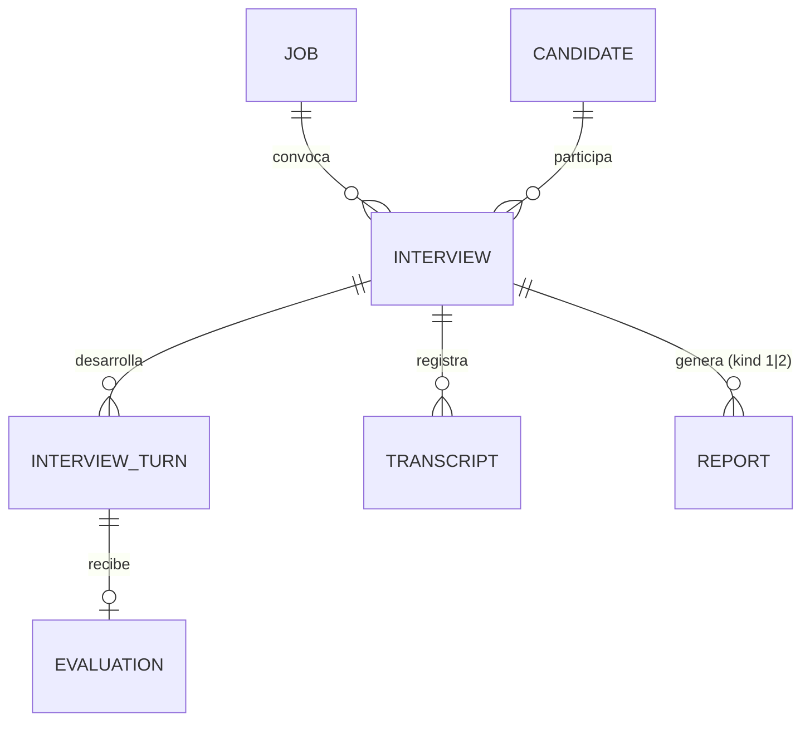

# Mapa del Sistema — Entrevistas Meet IA (leIA) · PoC

> Este documento es el **mapa de orientación arquitectónica** del sistema. Es co-mantenido por los skills `arquitecto-sdd` e `ing-requisitos-sdd` y consultado al inicio de cada análisis de requerimientos. Refleja el estado del sistema en su última actualización.
>
> **No editar manualmente sin coordinar con el equipo.** Si querés refrescarlo, invocá al Arquitecto SDD o al Ingeniero de Requisitos y pedile que lo regenere.

---

## Metadatos

- **Última actualización:** 2026-07-06
- **Generado por:** skill ing-requisitos-sdd
- **Commit del repo en el momento del scan:** `fa9a386` (`origin/feature/sala-nativa`, que contiene linealmente a `origin/develop` @ `eb6e489` y a `main` @ `0686437`). El working tree local está en `main`; por decisión del analista este mapa describe el estado con ambos branches integrados.
- **Tipo de scan:** Profundo (backend completo + frontend + branches sin mergear)
- **Versión del Mapa:** v1.0

---

## 1. Visión General del Sistema

Prueba de concepto de un **entrevistador virtual por IA ("leIA")** para procesos de selección. Un reclutador carga un puesto (generado desde el link de una oferta laboral), un candidato, y agenda una entrevista. leIA conduce la entrevista **por voz** en dos modalidades:

- **Modo `meet`:** un bot entra a una reunión real de Google Meet vía **Recall.ai**, habla con TTS y escucha por transcripción en streaming.
- **Modo `browser` (sala nativa, branch `feature/sala-nativa`):** el candidato entra a una sala propia en el navegador (`/sala/:id`, estética Google Meet) sin necesidad de Meet ni Recall.ai; el reconocimiento de voz corre en el browser (Web Speech API) y el audio de leIA llega por WebSocket.

En cada turno leIA evalúa la respuesta en 6 dimensiones (comunicación, técnicos, experiencia, resolución, actitud, trabajo en equipo), decide la siguiente pregunta (o pide aclaración) y, al finalizar —manual o automáticamente al cortar la llamada—, genera dos informes: **Informe 1** (narrativa + transcripción) e **Informe 2** (scoring, radar contra el nivel esperado por seniority, distribución de sentimiento y calidad, recomendación avanzar/segunda instancia/descartar).

La "inteligencia" es una abstracción (`LeiaService`) con motores intercambiables por env: heurística mock (demo sin costo), **Gemini** (driver temporal activo) o **Claude**. Igual patrón de drivers para captación (Recall real / mock / browser), TTS (mock / ElevenLabs / **Gemini TTS** / **Edge TTS**, elegible **por entrevista**) y persistencia (memoria / PostgreSQL).

Conceptos de dominio centrales: `Job` (puesto), `Candidate`, `Interview` (con `mode` y `ttsDriver`), `InterviewTurn` (par pregunta/respuesta), `TranscriptFragment`, `Evaluation`, `Report` (kind 1|2), `BehavioralAnalysis` (preparado, hoy sin productor), `AuditLog`.

---

## 2. Stack Tecnológico

### 2.1 Lenguajes y Runtimes
- **Backend:** TypeScript sobre Node.js ≥ 18 (`tsx` en dev, `tsc` a `dist/` en build).
- **Frontend:** TypeScript + React 18.

### 2.2 Frameworks Principales
- **Backend web:** Fastify 4 (`@fastify/cors`, `@fastify/sensible`, `@fastify/websocket`; `@fastify/jwt` y `@fastify/static` declarados pero **sin uso** en el código).
- **Frontend:** Next.js 13.5 (App Router, todo `'use client'`) + Tailwind 3. `@tanstack/react-query` declarado pero sin uso observado.
- **Validación:** Zod (config por env y bodies de rutas).
- **Testing:** vitest declarado en `backend/package.json`, **cero archivos de test** en el repo.
- **Logging:** pino + pino-pretty.

### 2.3 Persistencia
- **Driver dual por env `DATABASE_DRIVER`:** `memory` (default, Maps en proceso, `backend/src/db/memory.ts`) o `postgres` (`backend/src/db/postgres.ts`, pool `pg`).
- **Esquema:** `backend/src/db/schema.sql` (tablas `jobs`, `candidates`, `interviews`, `interview_turns`, `transcripts`, `evaluations`, `reports`, `audit_logs`). Se monta como init script en docker-compose.
- **⚠️ Deriva conocida:** el campo `Interview.mode` (sala nativa) NO existe en `schema.sql` ni en los INSERT/UPDATE de `postgres.ts` → la sala nativa solo funciona con driver `memory`.
- **Redis:** levantado en docker-compose pero **ningún código lo usa**.

### 2.4 Infraestructura y Despliegue
- **Local:** `npm run dev` (workspaces paralelos), docker-compose para Postgres+Redis.
- **Deploy:** `render.yaml` (Render.com) para el backend con `RECALL_DRIVER=recall`, `TTS_DRIVER=gemini`, `DATABASE_DRIVER=postgres`. Frontend pensado para Vercel (SETUP.md).
- **Exposición pública requerida (modo meet):** Recall.ai necesita alcanzar `PUBLIC_BASE_URL` (webhook + página bot-stage). Scripts auxiliares: `backend/scripts/start-ngrok.ts`, `start-cloudflared.ps1` (nota en código: ngrok free muestra interstitial y rompe el bot-stage; usar Cloudflare Tunnel).
- **Observabilidad:** solo logs pino.

### 2.5 Integraciones Externas
- **Recall.ai** (`services/recall/real.ts`): crea el bot en Meet (`output_media` → webpage bot-stage), transcripción `recallai_streaming`, webhook en tiempo real, reproducción por `output_audio` (MP3, desde develop) con fallback a WS del bot-stage.
- **Google Generative Language (Gemini):** motor leIA temporal (`services/leia/gemini.ts`) y TTS (`services/tts/gemini.ts`, PCM→WAV).
- **Anthropic Claude:** motor leIA alternativo (`services/leia/claude.ts`).
- **ElevenLabs:** TTS alternativo (`services/tts/elevenlabs.ts`).
- **Microsoft Edge Read-Aloud** (`msedge-tts`): TTS gratuito sin API key (`services/tts/edge.ts`, voz default `es-AR-ElenaNeural`); además fallback de Gemini TTS (desde develop).
- **face-api.js por CDN** (`frontend/lib/useFaceAnalysis.ts`): análisis facial en browser — hoy sin consumidor alcanzable.

---

## 3. Estructura del Repositorio

```
entrevistas-meet-ia/            monorepo npm workspaces
├── backend/
│   ├── assets/                 videos mp4 idle/hablando del avatar del bot (desde develop)
│   ├── scripts/                sondas manuales (test-tts, test-bot-audio, start-ngrok…) — NO tests automatizados
│   └── src/
│       ├── server.ts           Fastify: registro de rutas, auth Bearer global, health
│       ├── config.ts           Zod schema de env + summarizeDrivers + isDemoMode
│       ├── types.ts            entidades de dominio compartidas del backend
│       ├── db/                 interface Database + memory + postgres + schema.sql + seed
│       ├── routes/             REST: jobs · candidates · interviews · leia · reports
│       ├── realtime/           interview-ws (observador) · recall-webhook · bot-stage (página del bot) · browser-sala (sala nativa)
│       └── services/
│           ├── leia/           abstracción IA: index (factory) + mock + gemini + claude + prompts
│           ├── recall/         index (factory) + mock + real (Recall.ai) + browser (sala nativa)
│           ├── tts/            index (factory por driver) + mock + elevenlabs + gemini + edge
│           ├── interview/      engine.ts (orquestador) + analytics.ts (distribuciones determinísticas) + meet.ts (huérfano)
│           └── jobs/           fromLink.ts (link → Job) + fromForm.ts (muerto/roto, ver deuda)
├── frontend/
│   ├── app/                    App Router: / (dashboard) · puestos · candidatos · entrevistas · entrevistas/[id]/informe · sala/[id] (branch)
│   ├── components/             Layout, StatusBadge, ScoreBar, RadarChart, AnalyticsDonut + huérfanos (CandidateVideo, BotTile, BotAvatar)
│   └── lib/                    api.ts (cliente REST) · types.ts (espejo de tipos) · useVoice (Web Speech) · useFaceAnalysis (huérfano)
├── docs/specs/                 artefactos SDD (este mapa)
├── docker-compose.yml          Postgres + Redis (Redis sin uso)
├── render.yaml                 deploy backend en Render
├── README.md / SETUP.md        ⚠️ parcialmente desactualizados respecto del código (ver deuda)
└── .env.example
```

### Convenciones de organización
- Patrón **factory por driver de env**: cada integración externa expone `getX()` que resuelve mock/real según config, con **fallback silencioso a mock** si falta la API key, y **fallback en runtime** si la API falla a mitad de entrevista (leIA→mock, GeminiTTS→EdgeTTS, ElevenLabs→mock).
- Comunicación runtime por **EventEmitter** (`engine.events`, `recall.events`) + buses WS por entrevista (`botStageBus`, `browserSalaBus`) con buffering hasta handshake `ready`.
- Naming: kebab-case en archivos, español rioplatense en dominio, prompts y UI.
- El frontend duplica a mano los tipos del backend en `frontend/lib/types.ts` (sin paquete compartido).

### Proyectos hermanos / dependencias multi-repo

Ninguna — el sistema es autocontenido en este repo (frontend y backend como workspaces del mismo monorepo).

---

## 4. Modelos de Dominio

### 4.1 Entidades centrales

| Entidad | Propósito | Archivo principal | Relaciones clave |
|---|---|---|---|
| Job | Puesto a cubrir con requirements (stack, seniority) y preferences de entrevista (duración, dimensiones, tono, qué informes) | `backend/src/types.ts:25` | tiene-muchas Interviews |
| Candidate | Persona entrevistada (email único) | `backend/src/types.ts:41` | tiene-muchas Interviews |
| Interview | Entrevista con status, `mode` (meet/browser), `ttsDriver` por entrevista, meetUrl, botId, behavior | `backend/src/types.ts:90` | pertenece-a Job y Candidate; tiene Turns/Transcripts/Evaluations/Reports |
| InterviewTurn | Par pregunta/respuesta con índice y duración | `backend/src/types.ts:110` | pertenece-a Interview; 1-1 Evaluation |
| TranscriptFragment | Fragmento de transcripción con speaker bot/candidate/other | `backend/src/types.ts:125` | pertenece-a Interview |
| Evaluation | Score 0-10 + 6 dimensiones + flags + rationale por turno | `backend/src/types.ts:156` | pertenece-a Turn |
| Report | Informe 1 (narrativa) o 2 (scoring/analítica), payload JSONB, UNIQUE(interview, kind) | `backend/src/types.ts:236` | pertenece-a Interview/Candidate/Job |
| BehavioralAnalysis | Métricas de cámara (atención, lectura, expresiones) — preparado, sin productor | `backend/src/types.ts:55` | embebido en Interview y Reports |

### 4.2 Diagrama ER (resumen)



### 4.3 Esquema de base de datos
- **Migraciones:** no hay herramienta; `schema.sql` idempotente (`CREATE TABLE IF NOT EXISTS` + `ALTER TABLE ADD COLUMN IF NOT EXISTS` para `tts_driver`) ejecutado por docker-entrypoint y/o `PostgresDb.init()`.
- **Convenciones:** snake_case, TIMESTAMPTZ, JSONB para estructuras (requirements, dimensions, payload), CHECKs de enum en status/speaker/kind/tts_driver.
- **Deriva pendiente:** columna `mode` ausente (ver §9).

---

## 5. APIs y Contratos

### 5.1 APIs HTTP expuestas

Auth global: `Authorization: Bearer ${ADMIN_TOKEN}` para todo `/api/*` **excepto** `/api/health` y `/api/sala/*`; exentos también `/ws/*`, `/webhooks/*`, `/bot-stage*` (`backend/src/server.ts:54-66`).

| Grupo | Prefijo | Propósito | Archivo |
|---|---|---|---|
| Health | `GET /api/health` | Estado + drivers activos + demoMode | `src/server.ts:43` |
| Jobs | `/api/jobs`, `POST /api/jobs/from-link`, `DELETE /api/jobs/:id` | Puestos; creación heurística desde link | `src/routes/jobs.ts` |
| Candidates | `/api/candidates` (GET/POST/PATCH/DELETE) | ABM candidatos, email único | `src/routes/candidates.ts` |
| Interviews | `/api/interviews` (+ `/:id/start`, `/:id/finalize`, `/:id/simulate-answer`, `PATCH /:id/tts`, DELETE) | Ciclo de vida de la entrevista | `src/routes/interviews.ts` |
| leIA directo | `POST /api/leia/evaluate`, `POST /api/leia/next-question` | Contrato público de leIA fuera del flujo | `src/routes/leia.ts` |
| Reports | `GET /api/reports/:interviewId/:kind`, `GET /api/reports/by-interview/:id` | Informes 1 y 2 con contexto | `src/routes/reports.ts` |
| Bot stage | `GET /bot-stage/:id`, `GET /bot-stage-video/:key`, `GET /bot-stage-diag` | Página/video que Recall carga en el bot | `src/realtime/bot-stage.ts` |
| Sala nativa | `GET /api/sala/:id/info`, `POST /api/sala/:id/finalize`, `POST /api/sala/:id/recording` | Cara pública para el candidato (sin auth) | `src/realtime/browser-sala.ts` (branch) |
| Webhook | `POST /webhooks/recall/captions`, `GET /webhooks/recall/ping` | Eventos en tiempo real de Recall.ai | `src/realtime/recall-webhook.ts` |

### 5.2 Canales WebSocket

| Canal | Dirección | Propósito |
|---|---|---|
| `WS /ws/interview/:id` | server→cliente (+ `simulate_answer`, `stop`) | Observador en vivo de la entrevista. **Hoy ningún frontend lo consume** (la UI del reclutador usa polling). |
| `WS /ws/bot-stage/:id` | server→página del bot | Entrega audio (`play`) y señal visual (`talking`) a la página que Recall streamea al Meet; handshake `ready` + buffer. |
| `WS /ws/sala/:id` | bidireccional | Sala nativa: `ready` (arranca la entrevista), `transcript` (Web Speech del candidato), `hangup`; server manda `audio`, `question`, `status`, `finished`, `report_ready`. (branch) |

### 5.3 Contratos internos relevantes
- `LeiaService` (`services/leia/index.ts:65`): `firstQuestion`, `evaluate` (→ evaluación + nextQuestion + isClarification + shouldFinish), `buildReport1/2`, `generateFillers`, `generateClosing`.
- `RecallService` (`services/recall/index.ts`): `joinMeet`, `leaveMeet`, `playAudio`, eventos `caption|speaking|lifecycle|participant_left`.
- `TTSService` (`services/tts/index.ts`): `synthesize(text) → { audioBase64, mimeType, durationMs, bytes }`.
- `Database` (`db/index.ts:18`): interface completa CRUD por entidad.

---

## 6. Convenciones del Proyecto

### 6.1 Estilo de código
- ESLint `eslint-config-next` en frontend; sin linter configurado en backend.
- Comentarios y mensajes de commit en español, prefijos temáticos `#voz`, `#sala`, `#informe`.

### 6.2 Manejo de errores
- Rutas: validación Zod → 400 con `issues`; not-found → 404 `{error}`; auth → 401.
- Integraciones: **nunca cortar la entrevista** — todo driver externo cae a su fallback (mock o Edge) logueando `warn`. Gemini leIA reintenta un 429 solo si `retryDelay ≤ 5s`.

### 6.3 Logging
- pino estructurado; `logger.info/warn/error` con objetos contextuales (`interviewId`, `botId`). La URL de BD se loguea con password enmascarado (`db/index.ts:86`).

### 6.4 Validación de inputs
- Zod en el borde (rutas y config). Los services asumen inputs válidos. El parser JSON custom acepta body vacío como `{}` (`server.ts:32`).

### 6.5 Autenticación y autorización
- **Token Bearer estático único** (`ADMIN_TOKEN`) para toda la API admin; sin roles ni usuarios. El frontend lo inyecta desde `NEXT_PUBLIC_ADMIN_TOKEN` (expuesto al browser — ver §9).
- `JWT_SECRET`/`@fastify/jwt` configurados pero sin uso real.
- Superficies sin auth por diseño: sala del candidato, bot-stage, webhooks.

### 6.6 Testing
- **No hay tests automatizados.** `npm test` (vitest) no encontraría archivos. `backend/scripts/test-*.ts` son sondas manuales de integración (TTS, bot-stage WS, output media).

---

## 7. Módulos Principales

### Módulo: InterviewEngine (orquestador)
- **Propósito:** máquina de estados de una entrevista en vivo: pregunta → escucha → commit por silencio → evalúa → siguiente pregunta → informes.
- **Ubicación:** `backend/src/services/interview/engine.ts`
- **Claves:** registry de engines por interviewId; half-duplex anti-eco (`botSpeakingUntilMs`, desactivado en modo browser); commit tras `SILENCE_MS=700`; muletillas pre-sintetizadas filtradas (`isNeutralFiller`); guard de preguntas repetidas (Jaccard ≥ 0.6 → regenerar); auto-finalización a los 4 s de `participant_left`/`lifecycle left`; piso de turnos (≥ 6) y techo por tiempo (97 % de `durationMinutes`) o 16 turnos; **sentence-streaming TTS** (desde develop) con `markBotSpeaking` anclado al primer chunk; analíticas del Informe 2 recalculadas determinísticamente (`analytics.ts`).
- **Estado:** núcleo del sistema, evoluciona en cada branch.

### Módulo: leIA (abstracción IA)
- **Propósito:** evaluación, generación de preguntas, cierres, muletillas e informes con motor intercambiable.
- **Ubicación:** `backend/src/services/leia/`
- **Claves:** prompts extensos en `prompts.ts` (personalidad rioplatense, alcance técnico duro por stack, no repetir preguntas, JSON estricto); parsers defensivos (`extractJSON`, `clamp10`); pisos/techos de `shouldFinish` re-aplicados por código; fallback a mock ante cualquier error.
- **Estado:** driver activo Gemini (`gemini-2.5-flash-lite` default); Claude disponible; "IA propia" es aspiración declarada.

### Módulo: Recall / captación (meet)
- **Ubicación:** `backend/src/services/recall/real.ts` + `realtime/recall-webhook.ts` + `realtime/bot-stage.ts`
- **Claves:** bot con `output_media` webpage (bot-stage con avatar en video mp4, idle a 0.4× para bajar CPU de encode); transcripción `recallai_streaming`; audio primero por `output_audio` (solo MP3) con fallback a WS del bot-stage (desde develop); `classifySpeaker` heurístico por nombre del participante; mapeo botId→interviewId en memoria + metadata.
- **Estado:** funcional; requiere `PUBLIC_BASE_URL` público.

### Módulo: Sala nativa (browser) — branch `feature/sala-nativa`
- **Ubicación:** `backend/src/services/recall/browser.ts` + `realtime/browser-sala.ts` + `frontend/app/sala/[id]/page.tsx`
- **Claves:** `BrowserRecall` implementa `RecallService` sin servicios externos; el candidato transcribe con Web Speech (`useVoice`) y manda `transcript` por WS; la entrevista arranca sola con el mensaje `ready`; grabación compuesta en canvas 1280×720 (leIA + PiP candidato + audio mixeado) subida a `POST /api/sala/:id/recording` (solo se loguea, no se guarda); finalización por `hangup` o cierre de WS.
- **Estado:** nuevo, sin mergear; **incompatible con Postgres** (campo `mode` no persistido).

### Módulo: TTS
- **Ubicación:** `backend/src/services/tts/`
- **Claves:** factory cachea instancias por driver; selección **por entrevista** (`Interview.ttsDriver`, PATCH `/api/interviews/:id/tts`, solo `gemini|edge` desde la API); cadena de fallbacks Gemini→Edge→(mock).

### Módulo: Jobs desde link
- **Ubicación:** `backend/src/services/jobs/fromLink.ts`
- **Claves:** query hints (`?title=&company=&description=`) → og-tags del HTML → slug del path; detección heurística de stack (lista `KNOWN_STACK`) y seniority por regex; defaults de preferencias (20 min, 6 dimensiones, ambos informes).

### Módulo: Frontend reclutador
- **Ubicación:** `frontend/app/`
- **Claves:** dashboard, ABM de puestos/candidatos, agenda de entrevistas (modo meet exige pegar URL real de Meet; modo browser genera link de sala compartible — branch), detalle de entrevista con selector de voz y polling manual ("Refrescar"), informe único combinando Report 2 (principal) + Report 1 (narrativa/transcripción) con radar, donuts y barras.

### Módulo: Persistencia
- **Ubicación:** `backend/src/db/`
- **Claves:** interface única `Database`; `memory` para demo (pierde todo al reiniciar; los engines viven igualmente en memoria de proceso); `postgres` con mapping manual de columnas; `seed.ts` carga un puesto y candidato demo.

---

## 8. Decisiones Arquitectónicas Vigentes

1. **leIA es la marca y la abstracción; el motor es un detalle por env.** El contrato público (`/api/leia/*`, informes) no cambia con el driver.
2. **Todo driver externo tiene mock y fallback en runtime.** El sistema entero corre sin API keys (demo mode) y una entrevista en curso nunca se corta por fallo de un proveedor.
3. **Audio del bot vía Output Media (webpage) como canal garantizado**, con `output_audio` como camino rápido cuando el audio es MP3 (desde develop). El bot-stage bufferiza hasta handshake `ready`.
4. **Half-duplex por software** en modo meet: mientras leIA habla se descartan captions del candidato (anti-eco). En modo browser se desactiva (micrófono independiente).
5. **Las analíticas numéricas del Informe 2 no se delegan al LLM**: calidad y fallback de sentimiento se computan de los scores reales (`analytics.ts`).
6. **El fin de turno lo deciden los captions, no el VAD**: los eventos speech_on no cancelan el timer de commit (ruido ambiente); el silencio se mide sobre palabras reconocidas.
7. **Auth mínima de PoC:** un solo Bearer estático para la API admin; superficies del candidato/bot deliberadamente sin auth.
8. **Selección de TTS por entrevista** persistida en la entidad, editable solo en estado `agendada`.

---

## 9. Deuda Técnica Conocida

| Área | Descripción | Impacto en nuevos desarrollos |
|---|---|---|
| Build roto en branches | `services/jobs/fromForm.ts` (develop y sala-nativa) importa `JobModality`/`JobHiringStatus` y llama `leia.structureJob()` que **no existen** → `tsc` falla; nadie importa el archivo | Bloquea mergear develop/sala-nativa tal cual; hay que completar tipos+método o eliminar el archivo |
| Sala nativa vs Postgres | `Interview.mode` no está en `schema.sql` ni en `postgres.ts` | Sala nativa solo con `DATABASE_DRIVER=memory`; migración pendiente |
| README/SETUP desactualizados | TTS reales, transcripción, sala en vivo y alta de entrevista divergen del código (detalle en el snapshot SDD, sección 8.2) | Confunde onboarding y decisiones; actualizar tras cada merge |
| Token admin en el browser | `NEXT_PUBLIC_ADMIN_TOKEN` incrusta el Bearer en el bundle del frontend | Cualquier visitante del frontend puede operar la API admin; inaceptable fuera de PoC |
| Endpoints sin auth con efectos | `POST /api/sala/:id/finalize` y `/recording` sin token (branch); `GET /bot-stage/:id` público | Quien conozca/adivine un interviewId puede finalizar entrevistas o subir blobs |
| Sin tests | vitest declarado, 0 tests; solo sondas manuales | Todo snapshot de comportamiento queda a nivel [CODE]/[INFER]; regresiones invisibles |
| Código huérfano | `meet.ts` (generador de URLs), `CandidateVideo`/`BotTile`/`BotAvatar`/`useFaceAnalysis`, deps `@fastify/jwt`/`@fastify/static`/`lamejs`/`react-query`, Redis en compose | Ruido; riesgo de asumir capacidades inexistentes (p.ej. análisis facial "listo") |
| BehavioralAnalysis sin productor | Tipos, prompts e informes lo soportan; nadie lo captura ni envía | Feature aparenta existir; requiere integrar captura (p.ej. useFaceAnalysis) y POST behavior |
| Estado en memoria de proceso | Engines, buses WS y mapeo botId→interview viven en el proceso Node | Sin HA ni multi-instancia; un restart a mitad de entrevista la deja huérfana |
| Grabación no persistida | `/api/sala/:id/recording` solo loguea bytes | Falta storage (disco/S3) si la grabación es requisito |

---

## 10. Dependencias Externas Críticas

| Servicio | Propósito | Criticidad | Notas |
|---|---|---|---|
| Recall.ai | Bot en Meet + transcripción streaming + output_audio | Alta (modo meet) | Requiere `PUBLIC_BASE_URL` público; ~USD 0.20/entrevista 20 min; sin él queda el mock o la sala nativa |
| Gemini (Generative Language) | Motor leIA activo + TTS | Alta con `LEIA_DRIVER=gemini` | Free tier con rate limit ~5 req/min; retry corto + fallback mock/Edge |
| Anthropic Claude | Motor leIA alternativo | Media | Contrato idéntico vía `LeiaService` |
| Microsoft Edge TTS | TTS gratuito y fallback de Gemini TTS | Media | Sin API key; servicio no contractual (riesgo de cambios) |
| ElevenLabs | TTS premium | Baja (no default) | Solo si `TTS_DRIVER=elevenlabs` |
| face-api.js CDN | Análisis facial en browser | Baja (sin consumidor) | Carga modelos desde jsdelivr |

---

## CHANGELOG del Mapa

- **v1.0 (2026-07-06):** Versión inicial. Scan profundo del repo en commit `fa9a386` (`feature/sala-nativa`, incluye `develop` y `main`), generado por ing-requisitos-sdd durante el snapshot Modo D de la PoC.
