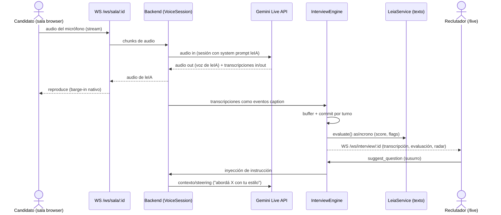
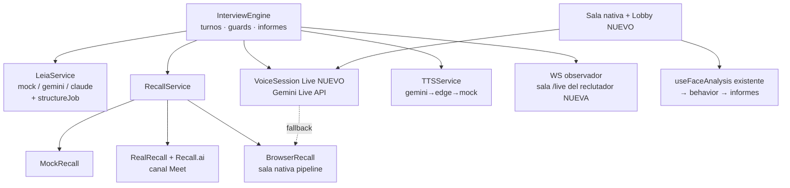

# Arnés del Agente Entrevistador leIA (Etapas 0-3) — Análisis del Arquitecto

## 0. Metadatos del Análisis

- **ID Ticket Redmine:** N/A (iniciativa interna; alcance `ENTREVISTADOR_IA_LEIA`)
- **Versión del análisis:** v1.0
- **Fecha:** 2026-07-06
- **Producido por:** Agente Arquitecto SDD (skill arquitecto-sdd)
- **Contrato(s) analizado(s):** PAR — snapshot `ENTREVISTADOR_IA_LEIA_ELICITADOR_MODO-D_v1.0.md` + cambios `ENTREVISTADOR_IA_LEIA_CAMBIOS_PROPUESTOS_v1.0.md`. Documentos fuente citados por el contrato: `docs/PROPUESTA_ARNES_AGENTE_ENTREVISTADOR_v1.0.md` y `docs/INVESTIGACION_ECOSISTEMA_GOOGLE_2026-07.md`.
- **Puerta y modo de elicitación:** Técnica — D (snapshot) + híbrido b+c (cambios con BDD a-priori)
- **Nivel de confianza del contrato:** Medio (declarado; correcto por construcción del modo D)
- **Perfil de marcas del contrato:** snapshot: 44 [CODE], 26 [INFER], 10 [CONFLICT], 0 [TEST] — **cero respaldo de tests**; cambios: BDD a-priori [USR]/[DOC], 9 gaps CHG-INFER. Lectura: el comportamiento actual del engine NO está verificado por tests → escepticismo alto al tocarlo (mitigado con tests de caracterización, ver decisión D7).
- **Base de código del análisis:** branch `main` @ `0686437`; working tree limpio (solo `docs/` sin trackear).
- **Base asumida por el contrato — verificación:** **NO CUMPLIDA HOY, según lo previsto.** El contrato asume `origin/feature/sala-nativa @ fa9a386` integrado; verificado 2026-07-06: `sala-nativa` **sigue sin mergear** (`git merge-base --is-ancestor` negativo), `main` local = `origin/main`. La historia es lineal (`main ⊂ develop ⊂ sala-nativa`), el merge es fast-forward sin conflictos. Disposición: **T01 del Plan Ejecutor**, tal como el contrato preveía. Ningún commit posterior a `fa9a386` en ningún branch → el contrato no está desactualizado.
- **Mapa del Sistema usado:** v1.0 (generado 2026-07-06, mismo día — fresco).
- **Próximo destinatario:** Agente Ejecutor (Codificador)
- **Plan de ejecución asociado:** `ENTREVISTADOR_IA_LEIA_PLAN_EJECUTOR_v1.0.md` (cubre Etapa 0 + spike; ver decisión D2)

---

## 1. Resumen Ejecutivo

- Se transforma la PoC en el **arnés del agente entrevistador**: lobby con consentimiento, voz conversacional con barge-in (Gemini Live API como driver primario de la sala nativa), avatar con estados, sala de observación en vivo del reclutador, susurro, señales de comportamiento conectadas al informe, informe compartible y pulido del canal Meet.
- El contrato (par snapshot + cambios) **se valida sin observaciones estructurales**: outcomes verificables, 15 BDD a-priori con datos concretos, 16 tareas en 4 etapas, gaps explícitos. Único ajuste: renumeración de tareas en el plan por inserción de 2 tareas nuevas (tests de caracterización y spike).
- **La base asumida no está integrada todavía**: mergear `feature/sala-nativa` (fast-forward, sin conflictos) es T01 y bloquea todo.
- **Bloqueante de build heredado y confirmado:** `fromForm.ts` no compila (tipos y método inexistentes). El PO decidió **completar** la feature, no eliminarla → la Etapa 0 crece de ~2 a ~4-5 días. Está reflejado en la estimación.
- **Decisión de diseño central (D1):** en la sala nativa con Live API, *el modelo conversa y el arnés supervisa* — el `InterviewEngine` conserva la propiedad del ciclo (turnos, evaluación, guards, informes) consumiendo las transcripciones del Live API como captions, y dirige al modelo por inyección de contexto. Así se preserva la tesis "cerebro intercambiable" y toda la lógica existente.
- **Riesgo dominante:** dependencia de una API en Preview sin SLA (Live API) con límites de sesión (15 min audio / 10 min conexión). Mitigación: spike temprano con compuerta go/no-go + cadena de fallback ya existente extendida.
- **Cobertura de tests actual: cero.** Antes de tocar el engine se escriben tests de caracterización (T04 del plan) — es la red de seguridad de todo lo que sigue.
- Estimación total Etapas 0-3: **~21 días-persona** (±20 %); Etapa 0 + spike: ~5,5 días. El calendario de la propuesta (2-3 semanas) es alcanzable con 2 personas en paralelo desde la Etapa 1.
- El Plan Ejecutor v1.0 cubre **Etapa 0 completa + spike del Live API**; los planes de las Etapas 1-3 se generan al cierre de la Etapa 0 con los resultados del spike (iteración natural del pipeline, evita especular sobre un contrato de API no verificado).

---

## 2. Validación del Contrato del Elicitador

| Sección | Veredicto | Comentario |
|---|---|---|
| Snapshot (completo, como base de referencia) | Validado | Generado hoy sobre `fa9a386`; verificado contra el repo en esta sesión; sin drift posterior (0 commits nuevos). |
| Cambios §1 Resumen | Validada | Coherente con la propuesta aprobada y las decisiones §7-bis. |
| Cambios §2-4 Outcomes (nuevos/modificados/obsoletos) | Validada | 11 nuevos verificables; las 2 regresiones intencionales están correctamente acotadas al canal browser. |
| Cambios §5 Constraints | Validada con observación | Los límites del Live API (15 min/10 min) provienen de docs públicas, no de código propio — exactamente lo que el spike (T06 del plan) debe confirmar. |
| Cambios §6 Integración | Validada | Los componentes a reutilizar existen en `fa9a386`; verificados en Fase 2 (contratos `LeiaService`/`RecallService`/`TTSService`, buses WS, `useFaceAnalysis`, `fromForm.ts` como contrato base). |
| Cambios §7 Task Breakdown (T01-T16) | Validada con ajustes | Orden topológico correcto. El plan inserta 2 tareas no previstas como tales: tests de caracterización del engine (recomendación §11 del propio contrato, la promuevo a tarea) y el spike del Live API (era parte de T06; lo separo como compuerta). Mapeo explícito en el Plan Ejecutor. |
| Cambios §8 BDD (15 nuevos + 3 modificados) | Validada | Datos concretos; hay caso de error de integración (AC-NEW-05) y caso de seguridad (AC-NEW-12). Cobertura de outcomes completa. |
| Cambios §10 Gaps (CHG-INFER-01..09) | Procesada | Ver tabla de disposición (sección 2.bis). |
| Snapshot §8 (gaps heredados que siguen abiertos) | Procesada | INFER-07/08 (seguridad) aceptados por el PO; INFER-11 (WAV vs output_audio) se convierte en nota de diseño D8. |

---

## 2.bis Disposición de Gaps Heredados

| Gap | Tipo | Disposición | Detalle |
|---|---|---|---|
| CHG-INFER-01 (contrato Live API no verificado) | Integración pendiente | **PROPAGADO** | Riesgo R01 + **T06 del plan (spike timeboxed con compuerta go/no-go)**. Los planes de Etapa 1+ no se emiten hasta tener sus resultados. |
| CHG-INFER-02 (voz es-AR en Live/Chirp) | Integración pendiente | **PROPAGADO** | Se valida dentro del spike (criterio explícito). Plan B ya operativo: Edge `es-AR-ElenaNeural`. |
| CHG-INFER-03 (encaje Live API ↔ engine) | Decisión diferida | **RESUELTO** | Decisión D1: "el modelo conversa, el arnés supervisa". Detalle en §3.1 y §7. |
| CHG-INFER-04 (librería PDF y límites) | Decisión diferida | **RESUELTO** | Decisión D3: `pdf-parse` (JS puro, sin deps nativas), máx 5 MB, sin OCR (PDFs-imagen fuera de alcance, coherente con "extracción simple" [USR]). |
| CHG-INFER-05 (storage del CV) | Decisión diferida | **RESUELTO** | Decisión D4: disco local `backend/uploads/` detrás de interface `FileStore` (alineada al punto de integración `RecordingStore` de T15 del contrato). |
| CHG-INFER-06 (estado en memoria de proceso) | Riesgo operacional | **PROPAGADO** | Riesgo R06, aceptado para demo. El runbook de demo (T16 del contrato) incluye la advertencia "no reiniciar el backend con entrevista en curso". |
| CHG-INFER-07 (auditoría de operaciones nuevas) | Decisión diferida | **RESUELTO** | Decisión D5: registrar en `audit_logs` (tabla existente): `consent_given/denied`, `question_suggested`, `report_shared`. Sin infraestructura nueva. |
| CHG-INFER-08 (presupuesto de tokens del CV) | Decisión diferida | **RESUELTO** | Decisión D3: texto truncado a 3.000 caracteres en prompts (consistente con los truncados existentes de `prompts.ts`). |
| CHG-INFER-09 (medición de latencia) | Definición pendiente | **RESUELTO** | Decisión D6: t0 = último caption final del candidato en el turno; t1 = primer chunk de audio de leIA; log estructurado `turn_latency_ms` por turno; objetivo demo p50 ≤ 1.500 ms. Persistencia en `telemetry` recién en T15 del contrato. |
| Snapshot INFER-07 (token admin en el browser) | Seguridad heredada | **PROPAGADO (aceptado)** | Decisión del PO (contrato §5). Riesgo R05 con guardarraíl: el link compartible (T13) usa token firmado propio con alcance de UN informe — prohibido reutilizar `ADMIN_TOKEN`. |
| Snapshot INFER-08 (endpoints de sala públicos) | Seguridad heredada | **PROPAGADO (aceptado)** | Ídem R05. Punto de integración auth multi-tenant queda comentado (T15 del contrato). |
| Snapshot INFER-11 (TTS WAV nunca va por output_audio en Meet) | Inferencia técnica | **RESUELTO** | Confirmado por lectura de `real.ts` (develop): `isMp3` filtra WAV. Decisión D8: en canal Meet se mantiene el selector por entrevista; documentar en la matriz de capacidades que `gemini` (WAV) siempre usa el fallback WS y `edge` (MP3) usa el camino rápido `output_audio`. Sin cambio de código. |
| Snapshot CONFLICT-01..09 (README vs código) | Conflictos doc | **RESUELTO (vía tarea)** | El contrato ya los dispone: T04 del contrato (README/SETUP). El plan lo incluye; ningún conflicto afecta áreas de diseño porque el código ganó como estado actual en el snapshot. |
| Snapshot INFER-01/03/04/05 (huérfanos y deps vestigiales) | Limpieza diferida | **PROPAGADO (fuera de alcance)** | El contrato los excluye explícitamente (§6). Quedan en Deuda Técnica del Mapa. Excepción: `useFaceAnalysis` deja de ser huérfano en T12 del contrato. |

**Ningún `[CONFLICT]` queda sin disposición; ningún gap bloqueante queda sin prerrequisito.**

---

## 3. Diseño Técnico Propuesto

### 3.1 Arquitectura

El principio rector es **no mover la propiedad del ciclo de entrevista**: el `InterviewEngine` sigue siendo el dueño de turnos, evaluaciones, guards, informes y auto-finalización. Todo lo nuevo entra como *drivers* o *estados* detrás de los contratos existentes (`LeiaService`, `RecallService`, `TTSService`, buses WS) — el mismo patrón que ya permitió tres implementaciones de captación (mock/real/browser).

**Sala nativa con Live API (Etapa 1) — "el modelo conversa, el arnés supervisa" (D1).** El Live API es un modelo conversacional full-duplex, no un par STT/TTS: intentar usarlo como "TTS que lee textos del engine" pelea contra su diseño. En cambio: la sesión Live recibe el *system prompt* de leIA (personalidad + puesto + CV + reglas duras, reutilizando `prompts.ts`) y conduce la conversación hablada con barge-in nativo. El arnés se engancha por los **eventos de transcripción** (entrada del candidato y salida del modelo) que el backend consume y convierte en los mismos eventos `caption` que hoy emite Recall — reutilizando íntegro el pipeline caption→turno→commit→persistencia. La **evaluación por turno** la sigue haciendo el driver de texto (`leia.evaluate()`) de forma asíncrona: puntúa, detecta flags y alimenta la sala de observación y los informes exactamente como hoy. La **dirección** (guard anti-repetición, susurro del reclutador, cierre por pisos/techos) se ejerce inyectando mensajes de contexto/instrucción a la sesión Live. Un `mode` de voz por entrevista (`live` | `pipeline`) decide el camino; ante fallo del Live API se degrada al pipeline actual dentro de la misma entrevista (cadena existente).

**Todo lo demás son extensiones locales:** el lobby es una pantalla previa que difiere el `ready` (el bus ya bufferiza); la sala de observación es un cliente nuevo del WS `/ws/interview/:id` que ya emite todo; el susurro es una cola en el engine consumida al armar la próxima pregunta; las señales de comportamiento son la conexión de `useFaceAnalysis` (existente) al payload `behavior` del finalize (existente); el informe compartible es una ruta pública con JWT firmado de alcance único; y "puesto desde formulario" completa un contrato que el propio código ya declaró (`fromForm.ts`).

### 3.2 Componentes

**A reutilizar (existentes, verificados en `fa9a386`):** `InterviewEngine` + registry (`services/interview/engine.ts`), `LeiaService` y drivers (`services/leia/*`), `RecallService` y `BrowserRecall`/`browserSalaBus` (`services/recall/browser.ts`, `realtime/browser-sala.ts`), `TTSService` y cadena de fallbacks (`services/tts/*`), WS observador (`realtime/interview-ws.ts`), `useFaceAnalysis` (`frontend/lib/useFaceAnalysis.ts`), `analytics.ts`, `prompts.ts`, tabla `audit_logs`, componentes de gráficos del informe.

**A modificar:** `types.ts` (backend y espejo frontend: tipos Job nuevos, flag de análisis, modo de voz), `schema.sql` + `postgres.ts` (columnas `jobs.*` nuevas, `interviews.mode`), `routes/jobs.ts` (from-form), `LeiaService` (+`structureJob`), `engine.ts` (cola de susurro, estados live/interrupted — Etapa 1/2), `app/sala/[id]/page.tsx` (lobby, barge-in UI, face analysis), `app/entrevistas/[id]/page.tsx` (estados del bot Meet), README/SETUP.

**A crear:** driver/gestor de sesión Live (`services/voice/live-session.ts`, nombre final a criterio del implementador dentro de `services/`), `services/jobs/` ruta from-form ya existe como builder — solo ruta y UI; página `/entrevistas/[id]/live` (observación); módulo de share de informes; `FileStore` + extracción PDF; tests (`backend/src/**/*.test.ts` — primera suite del repo); script de spike (`backend/scripts/spike-live-api.ts`).

### 3.3 Flujo de Datos (sala nativa, modo live)

Candidato (mic/cámara, browser) → WS `/ws/sala/:id` → backend puentea audio a la sesión Live API. Live API → audio de leIA → WS → sala (reproduce; barge-in lo maneja el propio modelo). En paralelo: transcripciones (in/out) → eventos `caption` → `InterviewEngine` → turnos + `evaluate()` texto → evaluaciones/flags → WS observador → sala de observación del reclutador. Susurro: reclutador → WS observador → cola del engine → inyección de instrucción a la sesión Live. Cierre (candidato corta / pisos-techos): engine → `stop()` → informes (pipeline existente) → `report_ready` a ambas salas.

---

## 4. Diagramas

### 4.1 Secuencia — turno de entrevista en sala nativa (modo live)

### 4.2 Componentes — el arnés y sus drivers

---

## 5. Riesgos Identificados

| ID | Riesgo | Categoría | Severidad | Mitigación |
|---|---|---|---|---|
| R01 | Live API en Preview, sin SLA; contrato de eventos conocido solo por docs públicas | Integración | **Alta** | Spike T06 con compuerta go/no-go antes de diseñar Etapa 1; cadena de fallback (pipeline→Edge/mock) garantiza que la entrevista no se cae (AC-NEW-05) |
| R02 | Límites de sesión Live (15 min audio / 10 min conexión) rompen entrevistas de 20 min | Integración | Alta | Resumption + compresión de contexto como criterio del spike (AC-NEW-04); si no satisface, el plan B es el pipeline con barge-in manual |
| R03 | Cero tests: tocar el engine (susurro, estados) puede romper commit/guards/auto-finish en silencio | Mantenibilidad | **Alta** | T04 del plan: tests de caracterización ANTES de cualquier cambio de engine; vitest ya declarado |
| R04 | Calidad de voz es-AR/neutra del Live API insuficiente para el "wow" | Integración | Media | Criterio explícito del spike; plan B Edge es-AR ya operativo |
| R05 | Superficie insegura heredada (token admin en bundle, endpoints de sala públicos) + nueva ruta pública de informes | Seguridad | Media (aceptado PO) | Guardarraíl: token de share firmado, expirable, alcance = un informe; auditoría de shares (D5); saneo real diferido a producto (punto de integración T15) |
| R06 | Estado en memoria de proceso: reinicio a mitad de entrevista la pierde (demo en vivo) | Operacional | Media | Aceptado; advertencia en runbook de demo (T16 contrato); refactor diferido |
| R07 | Rate limits / cuotas del tier de Gemini durante la demo en vivo | Operacional | Media | Prerrequisito: contratar tier pago antes de Etapa 1 (dueño: PO); fallbacks amortiguan |
| R08 | La decisión "completar fromForm" agranda la Etapa 0 y puede comerse el calendario | Operacional | Media | UI mínima (pestaña en /puestos/nuevo), `structureJob` mock reutiliza heurísticas de `fromLink.ts`; timebox 1,5 días |
| R09 | Señales de cámara: sensibilidad legal/ética (normativa IA, sesgos) | Seguridad | Media | Consentimiento explícito en lobby (AC-NEW-01/02), flag por puesto default ON pero desactivable (AC-NEW-10), "señales, no veredictos" (prompts ya alineados) |
| R10 | Doble fuente de "verdad conversacional" en modo live (lo que el modelo dice vs. lo que el engine cree que preguntó) | Mantenibilidad | Media | D1: las transcripciones de salida del modelo son la fuente de verdad de "pregunta hecha"; el engine registra el turno desde la transcripción, no desde un texto propio; verificar en tests de Etapa 1 |

---

## 6. Estimación de Esfuerzo

> Tareas del MD de Cambios Propuestos (T01-T16) + 2 insertadas por este análisis. Días-persona, 1 dev senior full-stack; ±20 %.

| Tarea | Estimación | Supuestos | Confianza |
|---|---|---|---|
| **Etapa 0 (Plan Ejecutor v1.0)** | | | |
| T01 contrato — merge branches | 0,25 d | Fast-forward verificado | Alta |
| T02 contrato — completar from-form (tipos+schema+structureJob×3+ruta+UI mínima) | 1,5 d | UI en pestaña de /puestos/nuevo; mock reutiliza heurísticas | Media |
| T03 contrato — `mode` + flag análisis en Postgres | 0,5 d | Patrón `tts_driver` replicable | Alta |
| **(nueva) tests de caracterización del engine** | 1 d | 8-10 tests con dobles in-process | Alta |
| T04 contrato — verificación e2e Postgres + README/SETUP | 1 d | Docker disponible | Alta |
| **(nueva) spike Live API (compuerta)** | 1 d timebox | API key tier pago disponible | Media |
| **Subtotal Etapa 0** | **~5,25 d** | | |
| **Etapa 1** | | | |
| T05 lobby + consentimiento | 1 d | | Alta |
| T06 driver Live (sesión, resumption, steering) | 3 d | Spike OK | **Baja-Media** |
| T07 cadena de fallback de voz + barge-in pipeline | 1,5 d | | Media |
| T08 avatar audio-reactivo con estados | 1 d | Assets mp4 existentes | Alta |
| T09 CV upload + extracción + prompts | 1 d | pdf-parse; 5 MB; 3k chars | Alta |
| **Subtotal Etapa 1** | **~7,5 d** | | |
| **Etapa 2** | | | |
| T10 sala de observación /live | 1,5 d | WS ya emite todo | Alta |
| T11 susurro (cola + steering + UI) | 1 d | | Media |
| T12 señales de comportamiento conectadas | 1,5 d | useFaceAnalysis existente | Alta |
| T13 informe compartible (JWT + vista pública) | 1 d | @fastify/jwt ya declarado | Alta |
| **Subtotal Etapa 2** | **~5 d** | | |
| **Etapa 3** | | | |
| T14 pulido Meet + matriz de capacidades | 1 d | | Alta |
| T15 puntos de integración comentados | 1 d | | Alta |
| T16 seed + guion + runbook demo | 0,5 d | | Alta |
| **Subtotal Etapa 3** | **~2,5 d** | | |
| **Total Etapas 0-3** | **~20-21 d-persona** | | |

Notas: (1) T06 es la tarea de mayor varianza — su estimación se refina con el spike; (2) con 2 devs, Etapas 1 y 2 tienen paralelismo real (candidato vs reclutador) → calendario de ~3 semanas es viable; (3) la decisión del PO sobre fromForm sumó ~1,5 d vs. la recomendación original de eliminarlo (registrado, no es un problema).

---

## 7. Decisiones de Diseño Tomadas

1. **D1 — Encaje Live API ↔ engine: "el modelo conversa, el arnés supervisa"** (cierra CHG-INFER-03). El Live API conduce la conversación hablada (system prompt de leIA, barge-in nativo); el engine conserva turnos/evaluación/guards/informes consumiendo las transcripciones como captions (reutiliza el pipeline caption→turno completo) y dirige por inyección de contexto. *Alternativas descartadas:* (a) Live API como STT+TTS "tonto" — pelea contra el diseño del API, latencia y complejidad artificiales; (b) Live API dueño total de la entrevista — pierde evaluación por turno, guards y la tesis del cerebro intercambiable. Origen: análisis del Arquitecto (decisión delegada por el contrato).
2. **D2 — Plan Ejecutor por compuertas:** v1.0 = Etapa 0 + spike; los planes de Etapas 1-3 se emiten al cierre con los resultados del spike. Evita planificar T06 sobre un contrato de API no verificado (regla meta del rol). Origen: análisis + sugerencia del propio contrato (§11).
3. **D3 — CV:** `pdf-parse` (JS puro), límite 5 MB, sin OCR; texto truncado a 3.000 caracteres para prompts (cierra CHG-INFER-04/08). Origen: convención del proyecto (deps livianas, truncados existentes en `prompts.ts`).
4. **D4 — Storage de CV:** disco local `backend/uploads/` tras interface `FileStore` (mismo patrón previsto para `RecordingStore` en T15) (cierra CHG-INFER-05).
5. **D5 — Auditoría mínima:** `audit_logs` existente registra `consent_given/denied`, `question_suggested`, `report_shared` (cierra CHG-INFER-07).
6. **D6 — Métrica de latencia:** `turn_latency_ms` = (primer chunk de audio de leIA) − (último caption final del candidato); log estructurado por turno; objetivo p50 ≤ 1.500 ms (cierra CHG-INFER-09).
7. **D7 — Tests de caracterización primero:** antes de modificar el engine se fija su comportamiento actual en tests (commit por silencio, aclaración sin avance, guard Jaccard, auto-finish idempotente, `splitSentences`, distribuciones de `analytics.ts`, `isNeutralFiller`). Mitiga R03. Origen: recomendación del contrato §11, promovida a tarea.
8. **D8 — Canal Meet sin cambios de audio:** se mantiene el selector TTS por entrevista; se documenta (matriz de capacidades) que `gemini` (WAV) siempre va por WS-fallback y `edge` (MP3) por `output_audio` (cierra INFER-11 del snapshot). Sin cambio de código.
9. **D9 — El token de share es propio y acotado:** JWT firmado con `JWT_SECRET`, claim = interviewId + kind, expiración configurable (default 30 días), y NUNCA el `ADMIN_TOKEN`. Mitiga que R05 no empeore.

---

## 8. Gaps Reportados al Elicitador

Ninguno. El contrato del Elicitador se validó sin requerir refinamiento — los 9 CHG-INFER estaban correctamente tipificados y todos recibieron disposición (6 resueltos por decisión del Arquitecto, 3 propagados con tarea/riesgo).

---

## 9. Actualizaciones Sugeridas al Mapa del Sistema

- **Sugerencia #1:** al cerrar la Etapa 0, actualizar §4.1/§4.3 (campos nuevos de `Job`, columna `interviews.mode`) y §9 (retirar las filas "Build roto en branches" y "Sala nativa vs Postgres" de deuda). Sección afectada: 4 y 9.
- **Sugerencia #2:** al cerrar el spike, registrar en §2.5/§10 el veredicto sobre Gemini Live API (proveedor nuevo con su criticidad). Sección afectada: 2.5 y 10.
- **Sugerencia #3:** cuando exista la primera suite (T04 del plan), actualizar §6.6 Testing (hoy dice "no hay tests"). Sección afectada: 6.6.

---

## 10. Plan de Ejecución

La ejecución detallada de la **Etapa 0 + spike** está en:

**`ENTREVISTADOR_IA_LEIA_PLAN_EJECUTOR_v1.0.md`**

Pensado para el siguiente agente de codificación. Los planes de las Etapas 1-3 se generarán como v1.1/v2.0 al cierre de la Etapa 0, incorporando los resultados del spike (compuerta D2).

---

## CHANGELOG

- v1.0 (2026-07-06): Versión inicial del análisis. Contrato par validado sin gaps al Elicitador; base no integrada → T01; 12 gaps dispuestos (6 RESUELTOS, 6 PROPAGADOS, 0 sin fila); 10 riesgos; ~21 d-persona estimados; plan v1.0 = Etapa 0 + spike.
