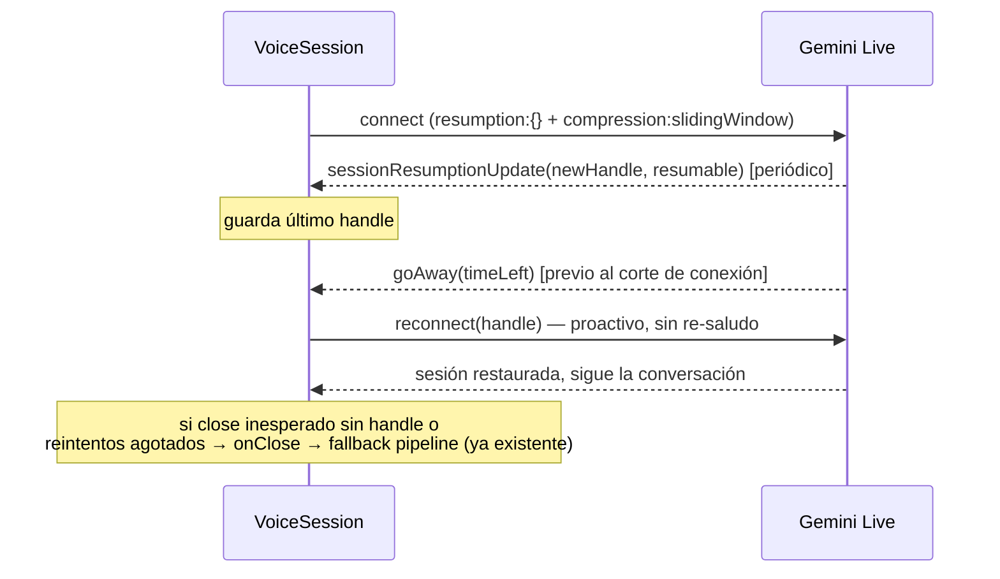

# Análisis del Arquitecto — Cierre de la Etapa 1: sesiones Live largas (AC-NEW-04) + CV verificable (AC-NEW-06)

## 0. Metadatos

- **ID Ticket:** ETAPA1-CIERRE
- **Versión:** v1.0
- **Fecha:** 2026-07-07
- **Contrato analizado:** `ENTREVISTADOR_IA_LEIA_CAMBIOS_PROPUESTOS_v1.0.md` §8.1 (puerta técnica, par con snapshot Modo D) — específicamente los DOS AC de la Etapa 1 que la auditoría de cierre encontró sin cerrar: AC-NEW-04 `[DOC]` y AC-NEW-06 `[USR]`. El resto de la etapa (AC-NEW-01/02/03/05, T05-T09) está ejecutado y verificado con evidencia real (ver Informes de Ejecución de ETAPA1, TUNE-LIVE-AUDIO y FIX-LIVE-ECHO-BARGEIN).
- **Base de código verificada:** branch `feature/arnes-etapa-1-candidato`, commit `e351530` = HEAD, working tree limpio (salvo 4 stubs de backup vacíos conocidos). CUMPLIDA.
- **Mapa del Sistema:** `docs/specs/ARQUITECTURA_DEL_SISTEMA.md`, fresco.

---

## 1. Resumen Ejecutivo

- **Brecha 1 (AC-NEW-04):** una entrevista Live de 20+ minutos tiene destino desconocido. Los límites documentados en el spike (~15 min de audio por sesión sin compresión, ~10 min por conexión) nunca se cruzaron en ningún smoke (máximo ~4 min), y `VoiceSession` hoy no configura `sessionResumption` ni `contextWindowCompression`, ni maneja `goAway` (el aviso del servidor antes de cortar), ni reconecta.
- **Verificado contra el SDK real (`@google/genai` 2.10.0 pinneado):** existen todos los mecanismos necesarios — `sessionResumption: { handle }` para reanudar, `sessionResumptionUpdate.newHandle`/`resumable` para obtener el handle, `goAway.timeLeft` como aviso previo, y `contextWindowCompression: { slidingWindow: {} }` para levantar el techo de 15 min de audio.
- **Diseño (D1):** la resiliencia vive TODA adentro de `VoiceSession` — guarda el último handle resumible, maneja `goAway` reconectando proactivamente, y ante cierre inesperado reintenta con el handle (máx. 2 intentos). El engine no cambia: su callback `onClose` (que dispara el fallback a pipeline) solo se emite cuando la reconexión se agotó o nunca hubo handle — el fallback existente queda como red de seguridad final, intacto.
- **Verificación honesta de AC-NEW-04 (D2):** ningún test corto puede probar límites de 10-15 minutos. Se agrega un **script de soak** (`backend/scripts/soak-live-session.ts`, mismo patrón que el spike) que mantiene una sesión real viva >12 minutos con audio periódico, registra handles/goAway/reconexiones y termina con veredicto. El Ejecutor lo corre de verdad (una vez, ~13 min de reloj, costo de API acotado).
- **Brecha 2 (AC-NEW-06):** el mecanismo de inyección del CV está implementado, pero el AC exige una referencia **concreta y verificable** (ej. "MercadoLibre", "3 años") en los primeros 3 turnos, y solo se validó contra el mock, que da un reconocimiento genérico.
- **Diseño (D3):** el mock pasa a extraer un fragmento notable del `cvText` y citarlo en `firstQuestion` (determinista, demoable sin API key). La verificación contra LLM real se hace en modo `meet` con recall mock (que sí soporta `simulate-answer`, a diferencia del browser) + `LEIA_DRIVER=gemini`, con un CV de contenido distintivo, inspeccionando los turnos persistidos. La verificación en modo `live` usa los turnos persistidos de la entrevista (la pregunta T0 reconstruida de la transcripción de salida).
- Estimación total: **~6.5h** → Plan Ejecutor único con dos grupos de tareas independientes (gate de granularidad no disparado; los grupos son paralelizables).

---

## 2. Disposición de Gaps Heredados

Del contrato original aplican dos gaps que habían quedado PROPAGADOS desde el análisis de la Etapa 1:

| Gap | Disposición |
|---|---|
| CHG-INFER-01 (contrato exacto del Live API — resumption/compresión) | RESUELTO parcialmente por el spike (campos aceptados) — este ticket cierra la parte pendiente: comportamiento real de los handles y la reconexión, verificado por el soak (T03). |
| R02 heredado ("session length untested", arrastrado desde ETAPA1_ARQUITECTO) | RESUELTO por este ticket (es exactamente su objeto). |
| CHG-INFER-09 (método de medición de latencia/telemetría) | Sin cambios — sigue diferido a T15 (Etapa 3). El soak agrega logs pero no telemetría persistida. |

---

## 3. Diseño Técnico

### Grupo A — AC-NEW-04: sesión Live de 20+ minutos

**Componentes a modificar:** `backend/src/services/voice/live-session.ts` (todo encapsulado ahí), `backend/scripts/soak-live-session.ts` (nuevo).

**D1 — Resiliencia encapsulada en `VoiceSession`:**
- Config de conexión suma: `sessionResumption: {}` y `contextWindowCompression: { slidingWindow: {} }`.
- `onmessage` suma: (a) `msg.sessionResumptionUpdate` → si `resumable && newHandle`, guardar en `this.resumptionHandle` (log debug); (b) `msg.goAway` → log info con `timeLeft` y reconexión proactiva.
- Se extrae `private async openSession(handle?: string)` con la config y callbacks compartidos; `connectAndGreet` lo usa sin handle y después manda el saludo; `reconnect()` lo usa con `this.resumptionHandle` y NO re-manda saludo (el estado se restaura del lado del servidor).
- `onclose` del SDK: si `this.intentionalClose` (seteado por `close()`) → emitir `onClose` normal y terminar. Si no: si hay handle y quedan intentos (máx. 2, con delay corto) → reconectar en silencio (log warn); si no hay handle o se agotaron los intentos → emitir `onClose` al engine, que dispara el fallback a pipeline ya existente (red de seguridad intacta).
- El engine (`engine.ts`) **no se toca**: su semántica actual ("si onClose llega y no terminamos → fallback") sigue siendo correcta porque ahora `onClose` solo llega cuando la reconexión fracasó de verdad.

**D2 — Verificación por soak, no por test corto:** `backend/scripts/soak-live-session.ts` (patrón de `spike-live-api.ts`): abre una sesión con la misma config que `VoiceSession`, envía audio real paced cada ~20s (reutilizando el helper de síntesis del spike o PCM de silencio+tono), corre ≥12 minutos para cruzar el límite de ~10 min de conexión, y reporta: handles recibidos (sí/no, cuántos), goAway recibido, reconexiones ejecutadas y si la sesión seguía respondiendo al final. Exit code 0 = AC-NEW-04 técnicamente sostenido; 1 = hallazgo a reportar.

### Grupo B — AC-NEW-06: leIA usa el CV real

**Componentes a modificar:** `backend/src/services/leia/mock.ts` (+ su test).

**D3 — Mock con referencia concreta:** `MockLeia.firstQuestion` extrae un fragmento notable del `cvText` (heurística determinista: la secuencia de palabras capitalizadas más larga que no sea el nombre del candidato, o en su defecto la primera línea no vacía truncada a ~60 chars) y lo cita: *"Vi en tu CV que mencionás «X» — contame más de eso."* Cumple AC-NEW-06 en demos sin API key y es testeable por unidad.

**Verificación contra drivers reales (sin código nuevo, solo ejecución):**
- **Pipeline + Gemini real:** entrevista `mode=meet` (el mock de Recall de meet SÍ implementa `simulate-answer`; el de browser no — limitación conocida), `LEIA_DRIVER=gemini`, `cvText` cargado (el endpoint `/api/sala/:id/cv` no filtra por modo, o vía update directo), correr 3 turnos simulados y verificar en los turnos persistidos que alguna pregunta referencia el contenido distintivo del CV.
- **Live:** entrevista `browser+live` con CV subido; verificar en el turno T0 persistido (pregunta reconstruida de la transcripción de salida) o en los logs de transcripción que el saludo/primera pregunta referencia el CV.

---

## 4. Riesgos

| ID | Riesgo | Severidad | Mitigación |
|---|---|---|---|
| R1 | El API en preview podría no emitir `sessionResumptionUpdate` nunca (en el spike, sesiones cortas no lo dispararon — no se sabe si es cuestión de duración o de soporte) | Alta | Es exactamente lo que el soak (T03) revela con evidencia. Si no llegan handles: la reconexión con estado es imposible hoy → se documenta como limitación del proveedor, el fallback a pipeline queda como comportamiento ante el corte (AC-NEW-05 ya verificado), y AC-NEW-04 se reporta como PARCIAL con causa externa — decisión de aceptación para el humano, no silenciosa. |
| R2 | Costo/tiempo del soak (~13 min de sesión Live real) | Baja | Se corre una sola vez; el tier pago ya se usó para los spikes. |
| R3 | El driver Gemini real puede no mencionar el CV en los primeros 3 turnos (no determinismo) | Media | CV de prueba con contenido muy distintivo + hasta 2 corridas. Si falla consistentemente, el ajuste sería de prompt (nueva iteración con el Arquitecto), no un hack del Ejecutor. |
| R4 | La reconexión a mitad de un turno puede perder audio en tránsito | Media | Aceptado para esta etapa: el modo `transparent` de resumption (que permite reenvío sin pérdida) queda documentado como mejora futura; para la demo, una pérdida puntual de <1 turno con reconexión es mejor que el corte total actual. |

---

## 5. Estimación

| Tarea | Estimación |
|---|---|
| T01 — Config resumption+compression, handles y goAway en VoiceSession | 1h |
| T02 — `openSession`/`reconnect` + política de reintentos + `intentionalClose` | 2h |
| T03 — Script de soak + corrida real (≥12 min) | 1.5h |
| T04 — Mock con referencia concreta al CV + test unitario | 45 min |
| T05 — Verificación AC-NEW-06 contra Gemini real (pipeline) y modo live | 1h |
| **Total** | **~6.5h** → Plan Ejecutor único (grupos A y B paralelizables) |

---

## 6. Actualizaciones sugeridas al Mapa del Sistema

Al cerrar la etapa completa, anotar en la sección de la sala nativa que el driver de voz primario es Gemini Live con resumption+compresión y fallback a pipeline (hoy el Mapa describe solo el pipeline).

---

## 7. Puntero al Plan Ejecutor

`docs/specs/ENTREVISTADOR_IA_LEIA_ETAPA1-CIERRE_PLAN_EJECUTOR_v1.0.md`

---

## CHANGELOG

- v1.0 (2026-07-07): Análisis inicial del cierre de etapa. D1 (resiliencia encapsulada en VoiceSession), D2 (verificación por soak), D3 (mock con referencia concreta). SDK verificado contra la versión pinneada.
