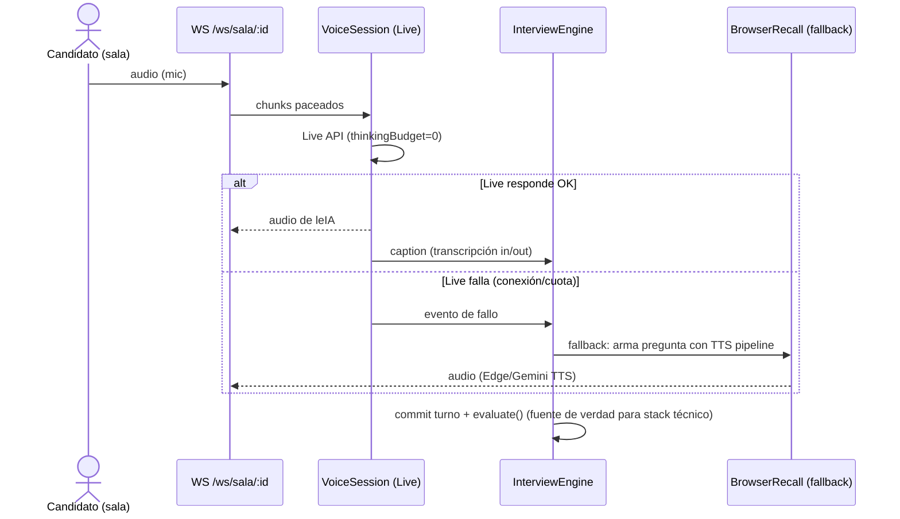
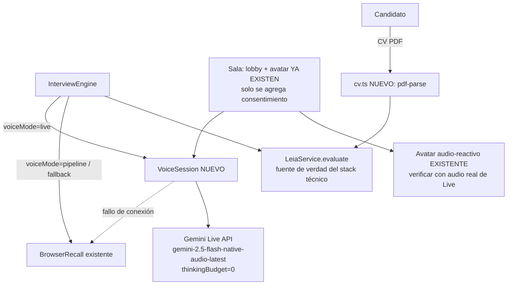

# Arnés leIA · Etapa 1 (Wow Candidato — sala nativa) — Análisis del Arquitecto

## 0. Metadatos del Análisis

- **ID Ticket Redmine:** N/A (alcance `ENTREVISTADOR_IA_LEIA`, Etapa 1 del contrato)
- **Versión del análisis:** v1.1 (corrección de errata — ver nota abajo)
- **Fecha:** 2026-07-06

> **Corrección v1.1:** la verificación focalizada inicial (Fase 2) no leyó en suficiente profundidad `frontend/app/sala/[id]/page.tsx` antes de estimar T05/T08. Una segunda lectura completa reveló que **el lobby con preview de cámara/mic y el avatar con 3 estados (idle/hablando/pensando) ya están implementados** (llegaron con el merge de `feature/sala-nativa` en la Etapa 0) — no son trabajo nuevo. Esto corrige la partición y las estimaciones de §6 y la tabla de Partición Aplicada. Confirmado por el desarrollador.
- **Producido por:** Agente Arquitecto SDD (skill arquitecto-sdd)
- **Contrato(s) analizado(s):** `ENTREVISTADOR_IA_LEIA_CAMBIOS_PROPUESTOS_v1.0.md` §7 (T05-T09), leído junto con su snapshot `ENTREVISTADOR_IA_LEIA_ELICITADOR_MODO-D_v1.0.md`
- **Puerta y modo de elicitación:** Técnica — D (snapshot) + híbrido b+c (cambios). Sin cambios de contrato desde el análisis de Etapa 0; se reutiliza la validación ya hecha en `ENTREVISTADOR_IA_LEIA_ARQUITECTO_v1.0.md` §2.
- **Nivel de confianza del contrato:** Alto para esta etapa — a diferencia de la Etapa 0, ahora hay **evidencia real** (2 spikes) respaldando las decisiones de T06/T07, no solo inferencia de documentación pública.
- **Base de código verificada:** branch `feature/arnes-etapa-0-saneo` @ `68c289e` (Etapa 0 + Spike 2 ya commiteados). Working tree limpio. **NO mergeado a `main` todavía** — ver Decisión D1 de este análisis sobre estrategia de branch.
- **Mapa del Sistema usado:** v1.0 (`docs/specs/ARQUITECTURA_DEL_SISTEMA.md`, generado 2026-07-06, 1 commit de distancia — fresco).
- **Insumos adicionales (no son el contrato, son evidencia de spikes ya incorporada por decisión del Arquitecto):** `ENTREVISTADOR_IA_LEIA_ARQUITECTO_v1.0.md` (D1 original), `ENTREVISTADOR_IA_LEIA_ARQUITECTO_v1.1.md` (addendum, D1'), `SPIKE_LIVE_API_RESULTADOS_v1.1.md` (evidencia real de latencia/barge-in/steering).
- **Próximo destinatario:** Agente Ejecutor (Codificador) — **pendiente de validación de partición antes de emitir los Planes Ejecutores** (ver §Partición Aplicada).
- **Plan(es) de ejecución asociado(s):** a emitir tras validación — ver §10.

---

## 1. Resumen Ejecutivo

- La Etapa 1 implementa el "wow candidato": lobby con consentimiento (T05), voz conversacional real vía Gemini Live API con barge-in (T06), cadena de fallback si Live falla (T07), avatar audio-reactivo (T08) y CV en el contexto de leIA (T09).
- **A diferencia del análisis de Etapa 0, T06 ya no es la tarea de mayor incertidumbre.** Los dos spikes ejecutados (`SPIKE_LIVE_API_RESULTADOS_v1.1.md`) confirmaron con evidencia real: conexión estable, audio bidireccional, transcripción de salida de calidad, voces en español con voseo natural, **latencia 1296ms con `thinkingConfig.thinkingBudget=0`** (antes ~4.7s), y **barge-in confirmado (621ms de detección)** con audio paceado a tiempo real. La confianza de T06 sube de "Baja-Media" (v1.0) a **Alta**.
- **El "susurro del reclutador" (D1' punto 3, mecanismo de steering) NO es parte de esta etapa** — es T11 de la Etapa 2. Se defiere explícitamente esa decisión (Live API no soporta `tools`/function-calling para esto, confirmado) sin bloquear la Etapa 1.
- **Hallazgo que SÍ condiciona el diseño de esta etapa:** la transcripción de entrada de Live pierde términos técnicos específicos (React, PostgreSQL — Spike 2, Test H1). Decisión D3 de este análisis: la evaluación de leIA (`leia.evaluate()`) sigue siendo la única fuente de verdad para detectar contenido técnico — la transcripción de Live solo reconstruye turnos, nunca reemplaza la evaluación semántica (esto ya era así por diseño D1 original; se confirma y refuerza, no cambia código).
- **Gate de granularidad activado:** la estimación total de T05-T09 supera las 8 horas (∼28h revisadas, ver §6). **Se particiona en 5 tickets ≤6h cada uno**, en rebanadas verticales por outcome — ver §Partición Aplicada. Esto reemplaza la estimación monolítica de 7,5 días de `ARQUITECTO_v1.0.md` §6 (esa estimación se hizo sin la evidencia de los spikes; con evidencia real, el trabajo restante es menor y más predecible).
- **Decisión de dependencia:** `@google/genai` está hoy en `devDependencies` (uso de spike). Para Etapa 1 pasa a **dependency** real — se usa en código de producción (T06).
- **Branch:** Etapa 0 sigue sin mergear a `main`. Recomiendo mergear `feature/arnes-etapa-0-saneo` a `main` antes de arrancar Etapa 1 (evita acumular más branches divergentes) — ver Decisión D1.

---

## 2. Validación del Contrato del Elicitador

Sin cambios respecto a la validación ya hecha en `ENTREVISTADOR_IA_LEIA_ARQUITECTO_v1.0.md` §2 (T05-T09 ya estaban validados ahí). Esta sección solo registra qué cambió con la evidencia nueva:

| Sección del contrato | Veredicto (v1.0, heredado) | Actualización con evidencia de spikes |
|---|---|---|
| T05 Lobby | Validada | Sin cambios — no dependía de Live API |
| T06 Driver Live | Validada con observación (límites 15/10 min de docs públicas) | **Actualizada:** modelo real confirmado (`gemini-2.5-flash-native-audio-latest`), latencia y barge-in confirmados con evidencia propia, no solo documentación de terceros |
| T07 Fallback | Validada | Sin cambios — el criterio AC-NEW-05 sigue igual; ahora sabemos con más precisión CUÁNDO se dispara (fallo de conexión/cuota, no falta de barge-in — eso ya funciona) |
| T08 Avatar | Validada | Sin cambios |
| T09 CV | Validada | Sin cambios |
| AC-NEW-03/04 (BDD de T06) | BDD a-priori sin verificar | **Ahora tienen respaldo empírico** vía los spikes — dejan de ser puramente `[USR]`/`[DOC]` y pasan a tener evidencia `[TEST-EXEC]`-equivalente (spike, no test automatizado, pero corrido de verdad contra la API real) |

---

## 2.bis Disposición de Gaps Heredados

| Gap | Origen | Disposición |
|---|---|---|
| CHG-INFER-01 (contrato Live API no verificado) | Contrato original | **RESUELTO** — 2 spikes con evidencia real (`SPIKE_LIVE_API_RESULTADOS_v1.1.md`) |
| CHG-INFER-02 (voz es-AR en Live) | Contrato original | **RESUELTO parcialmente** — Puck/Kore/Aoede confirmadas con voseo rioplatense por transcripción; falta validación por oído humano (no bloqueante, se hace en el smoke test de T04/T3 de esta etapa) |
| D1' punto 3 (mecanismo de steering) | Addendum v1.1 | **PROPAGADO a Etapa 2** — no es parte de esta etapa (T11 no está en el rango T05-T09); se resolverá al planificar Etapa 2 |
| D1' punto 4 (transcripción de entrada pierde términos técnicos) | Addendum v1.1 / Spike 2 | **RESUELTO** — Decisión D3 de este análisis: `leia.evaluate()` sigue siendo la fuente de verdad, sin cambio de código necesario, solo confirmación de diseño |
| R02 (límites de sesión 15/10 min, snapshot original) | Snapshot | **PROPAGADO** — sigue sin probarse con sesión real de 20 min; pasa a ser criterio de la Ticket 2 de esta partición (sesión debe sostenerse el largo de una entrevista real, con resumption si hace falta) |

---

## 3. Diseño Técnico Propuesto

### 3.1 Arquitectura

Se mantiene íntegro el principio de `ARQUITECTO_v1.0.md` §3.1: el `InterviewEngine` no pierde la propiedad del ciclo. Lo nuevo de esta etapa es la implementación concreta de la "pata de audio" de D1':

**`VoiceSession` (nuevo, `backend/src/services/voice/live-session.ts`):** encapsula la conexión al Gemini Live API. Responsabilidades:
- Conectar con `model: 'gemini-2.5-flash-native-audio-latest'`, `thinkingConfig: { thinkingBudget: 0 }` (no negociable — Spike 2 lo confirma como fix de latencia), `inputAudioTranscription`/`outputAudioTranscription` habilitados, `sessionResumption: {}`.
- Puentear audio: recibe chunks del candidato desde `browserSalaBus` (WS `/ws/sala/:id`) y los reenvía a `sendRealtimeInput` **paceados a su duración real** (confirmado como necesario en Spike 2 — un burst-send no dispara barge-in ni transcribe bien).
- Emitir el audio de salida de leIA de vuelta al bus de la sala.
- Traducir `serverContent.inputTranscription`/`outputTranscription` en los mismos eventos `caption` que hoy emite `BrowserRecall` — el `InterviewEngine` no se entera de que cambió el canal (mismo contrato `RecallService`, ver `ARQUITECTO_v1.0.md` §3.2).
- Traducir `serverContent.interrupted` en la señal que hoy usa el engine para el estado de "eco"/interrupción (nuevo estado, no existía en modo browser porque el half-duplex estaba desactivado — con Live API el modelo se auto-interrumpe, así que el engine debe enterarse para no seguir esperando audio que ya no va a llegar).
- Ante error de conexión/cuota: emitir un evento de fallo que dispare la cadena de fallback (T07) — el engine cae al pipeline STT/TTS existente sin que la entrevista se corte (mismo patrón de fallback ya usado en `services/leia/gemini.ts`, `services/tts/gemini.ts`).

**Integración con `InterviewEngine`:** un campo nuevo (`voiceMode: 'live' | 'pipeline'`) por entrevista decide el camino. `BrowserRecall` (existente) sigue siendo el driver del pipeline de fallback; `VoiceSession` es el driver primario cuando `voiceMode='live'`. Ambos implementan el mismo contrato de eventos (`caption`, `speaking`, `interrupted`), así que el engine no necesita ramas de código por modo — solo el punto de creación del driver en `start()` decide cuál instanciar.

**Avatar (T08):** puramente frontend — anima `frontend/app/sala/[id]/page.tsx` con un analizador de amplitud (`AnalyserNode` de Web Audio API, ya hay precedente de uso de `AudioContext` en el commit `#sala layout exacto Meet + fix audio` de la historia del repo) sobre el audio real que se está reproduciendo, sin importar si viene de Live o del pipeline. No depende de T06/T07 en su lógica interna, solo de "hay audio sonando ahora" — señal que YA existe en ambos caminos.

**CV (T09):** completamente independiente de la voz. Ruta nueva de upload + `pdf-parse` + columna de texto extraído en `candidates` + inclusión truncada (3.000 caracteres, decisión D3 de `ARQUITECTO_v1.0.md`) en los prompts de `firstQuestion`/`evaluate`.

### 3.2 Componentes

**A crear:**
- `backend/src/services/voice/live-session.ts` — `VoiceSession` (wrapper del SDK `@google/genai`)
- `backend/src/routes/candidates.ts` (modificar) + `backend/src/services/candidates/cv.ts` (nuevo) — upload + extracción de PDF
- Frontend: pantalla de lobby dentro de `frontend/app/sala/[id]/page.tsx` (o extraída a componente `LobbySala.tsx`)
- Frontend: lógica de animación del avatar (puede vivir en el mismo `page.tsx` o extraerse)

**A modificar:**
- `backend/src/types.ts` / `frontend/lib/types.ts` — `Interview.voiceMode`, `Candidate.cvText` (o similar)
- `backend/src/db/schema.sql` + `postgres.ts` — columnas nuevas (`interviews.voice_mode`, `candidates.cv_text`), patrón idempotente ya usado 3 veces en Etapa 0
- `backend/src/services/interview/engine.ts` — selección de driver por `voiceMode`, manejo del estado `interrupted`
- `backend/src/services/leia/prompts.ts` o donde arme `firstQuestion`/`evaluate` — inclusión del CV truncado
- `backend/package.json` — mover `@google/genai` de `devDependencies` a `dependencies`; agregar `pdf-parse`

**A reutilizar (sin cambios):** `browserSalaBus`, `RecallService` (contrato), `BrowserRecall` (queda como el driver de fallback), toda la cadena de TTS existente (Edge/Gemini/mock) para el camino de fallback, assets de avatar ya presentes en `backend/assets/`.

---

## 4. Diagramas

### 4.1 Secuencia — turno con Live API + fallback

### 4.2 Componentes

---

## 5. Riesgos Identificados (actualiza `ARQUITECTO_v1.0.md` §5)

| ID | Riesgo | Severidad | Mitigación |
|---|---|---|---|
| R02 (heredado) | Sesión Live de 20 min real sin probar | Media (bajó de Alta — el mecanismo de resumption existe y no dio error) | Criterio explícito en Ticket 2: sostener una sesión de duración real de demo (mínimo 10 min simulados) |
| R13 (nuevo) | `VoiceSession` es código nuevo sin tests — mismo riesgo que motivó T04 en Etapa 0 | Alta | Extender la suite de vitest ya existente con tests de la lógica de pacing/fallback (no de la API real, que no es mockeable fácil — sí de las funciones puras: cálculo de pacing, decisión de fallback) |
| R14 (nuevo) | Mover `@google/genai` a `dependencies` sin pin de versión exacta puede traer cambios breaking del SDK (todavía en evolución activa, 2.10.0) | Media | Fijar versión exacta (sin `^`) hasta estabilizar |
| R15 (nuevo) | El estado `interrupted` es nuevo en el engine — puede interactuar mal con el guard de half-duplex existente (`isBotSpeaking`) que fue diseñado para el modelo half-duplex viejo | Alta | Ticket 3 debe incluir tests de caracterización ANTES de tocar `engine.ts` (mismo patrón que T04 de Etapa 0) |
| R16 (nuevo) | Extracción de PDF con `pdf-parse` sobre archivos corruptos/escaneados puede tirar excepciones no controladas | Baja | Try/catch con mensaje claro; PDFs-imagen ya están fuera de alcance por decisión previa (D3) |

---

## 6. Estimación de Esfuerzo (revisada — spikes + corrección de errata, y aplicación del Gate de Granularidad)

> La estimación de `ARQUITECTO_v1.0.md` §6 (7,5 días ≈ 60h) se hizo ANTES de los spikes, con una confianza "Baja-Media" en T06. Con evidencia real y la corrección de v1.1 (T05/T08 ya están mayormente implementados), el trabajo restante es bastante menor.

| Tarea del contrato | Estimación revisada | Confianza | Nota |
|---|---|---|---|
| T05 Lobby | **3h** (corregido de 5h) | Alta | Lobby/preview/gating YA existen; solo falta consentimiento (2 checks + persistencia) |
| T06 Driver Live | 6h (conexión básica) + 6h (integración completa con el engine) | **Alta** (subió desde Baja-Media) | Se divide en 2 tickets por el gate |
| T07 Fallback + barge-in | 6h | Alta | El barge-in YA está confirmado (Spike 2); esto es "cablear" el patrón, no investigarlo |
| T08 Avatar | **0h como ticket propio** (corregido de 5h) | Alta | Ya implementado (idle/talk video switching, thinking/speaking UI); pasa a ítem de verificación dentro de los tickets 2 y 3 (confirmar que reacciona igual de bien con audio de Live) |
| T09 CV | 5h | Alta | Sin cambios |
| **Total** | **~20h** | | vs. 60h estimadas en v1.0 — la reducción refleja incertidumbre resuelta por los spikes MÁS la corrección de alcance (v1.1) |

**20h > 8h → el gate de granularidad se activa. No se emite un Plan Ejecutor único.**

---

## 7. Decisiones de Diseño Tomadas

1. **D1 (esta etapa) — Mergear Etapa 0 a `main` antes de arrancar:** `feature/arnes-etapa-0-saneo` sigue sin mergear. Recomiendo hacerlo (fast-forward o merge normal, ya validado y con tests pasando) antes de que la Etapa 1 abra sus propios branches por ticket, para no acumular divergencia. **Pendiente de confirmación del desarrollador** — no lo hago yo, es una acción de git que corresponde al desarrollador o al Ejecutor con autorización explícita.
2. **D2 — `@google/genai` pasa a `dependencies`:** se usa en código de producción (T06), no solo en el script de spike. Fijar versión exacta `2.10.0` (sin caret) dado que es un SDK en evolución activa sobre una API en Preview.
3. **D3 — La transcripción de Live nunca reemplaza `leia.evaluate()` como fuente de verdad técnica:** confirma y refuerza D1 original; sin cambio de código, es una restricción de diseño a respetar en la implementación de `VoiceSession` (no se le agrega ninguna lógica de "detectar stack mencionado" a partir de la transcripción).
4. **D4 — El "susurro" (steering) queda completamente fuera de esta etapa:** T11 es Etapa 2; la decisión sobre su mecanismo (las 3 alternativas del veredicto D1') se toma cuando se planifique esa etapa, no ahora.
5. **D5 — Partición en 5 tickets verticales** (detalle en la sección siguiente), por outcome, no por capa técnica — cumple el gate de granularidad.

---

## 8. Gaps Reportados al Elicitador

Ninguno. El contrato de Etapa 1 (T05-T09) no requiere refinamiento — la única novedad es evidencia que lo confirma, no una divergencia.

---

## 9. Actualizaciones Sugeridas al Mapa del Sistema

- Al cerrar esta etapa: agregar el módulo `VoiceSession`/Live API a la sección de integraciones externas del Mapa (hoy solo lista Recall.ai, Gemini texto, Claude, ElevenLabs, Edge TTS).
- Actualizar la fila de "Deuda Técnica" que menciona la falta de tests del engine — parcialmente resuelta en Etapa 0, y esta etapa la extiende más.

---

## Partición Aplicada (Gate de Granularidad)

**Criterio de corte:** vertical por outcome del contrato, en el orden de dependencia real (lobby → conexión Live → barge-in/fallback → avatar/CV en paralelo). Cada ticket es demostrable de punta a punta (una persona puede ver/probar el resultado sin esperar a los demás tickets, salvo las dependencias declaradas).

| Ticket | Alcance | Tareas del contrato que cubre | AC/Outcomes | Estimación | Depende de |
|---|---|---|---|---|---|
| **ETAPA1-01** — Lobby: consentimiento | El lobby (preview, gating) YA existe; se agregan 2 checks de consentimiento (grabación / análisis) + persistencia en la entrevista | T05 | AC-NEW-01, AC-NEW-02; Outcome A | **3h** (corregido) | Ninguno |
| **ETAPA1-02** — Conexión básica a Gemini Live + transcripción→turnos | `VoiceSession` conecta con `thinkingConfig=0`, system prompt de leIA; transcripciones entran como eventos `caption` existentes; primera pregunta suena por voz real; **verificar que el avatar existente reacciona bien a este audio** | T06 (parte 1) + verificación T08 | AC-NEW-04 (latencia); parte de Outcome B/C/J | 6h | ETAPA1-01 |
| **ETAPA1-03** — Barge-in real + cadena de fallback | Audio del candidato paceado vía `sendRealtimeInput`; interrupción corta reproducción y estado del engine; ante fallo de Live, degrada al pipeline STT/TTS existente sin cortar la entrevista; **verificar el avatar en el escenario de interrupción** | T06 (parte 2) + T07 + verificación T08 | AC-NEW-03, AC-NEW-05; Outcome B, J, K | 6h | ETAPA1-02 |
| **ETAPA1-04** — CV del candidato en el contexto de leIA | Upload PDF, extracción `pdf-parse`, persistencia, inclusión truncada en prompts de leIA | T09 | AC-NEW-06; Outcome H | 5h | Ninguno (independiente, puede arrancar en paralelo desde el día 1) |

**Total: 20h en 4 tickets**, cada uno ≤6h. ETAPA1-04 puede arrancar en paralelo desde el inicio.

~~T08 (avatar) como ticket propio~~ — **eliminado tras corrección v1.1**: ya está implementado (idle/talk video switching + thinking/speaking UI en `frontend/app/sala/[id]/page.tsx`, ver corrección de metadatos). Pasa a ser un criterio de verificación dentro de ETAPA1-02 y ETAPA1-03, no una tarea de desarrollo.

**Decisiones confirmadas por el desarrollador (2026-07-06):**

1. Partición validada, con la corrección de v1.1 (4 tickets, ~20h) también confirmada.
2. Se mergea `feature/arnes-etapa-0-saneo` → `main` antes de arrancar. Es una acción de git que le corresponde al Ejecutor (no al Arquitecto): queda como prerrequisito del primer ticket (ETAPA1-01, tarea T00).
3. **Un único branch de etapa:** `feature/arnes-etapa-1-candidato`, creado desde `main` tras el merge. Los 4 tickets se ejecutan sobre este mismo branch (no un branch por ticket).

---

## 10. Plan de Ejecución

Se generan los siguientes Planes Ejecutores, todos sobre el branch único `feature/arnes-etapa-1-candidato`:
- `ENTREVISTADOR_IA_LEIA_ETAPA1-01_PLAN_EJECUTOR_v1.0.md` — Lobby: consentimiento
- `ENTREVISTADOR_IA_LEIA_ETAPA1-02_PLAN_EJECUTOR_v1.0.md` — Conexión básica a Gemini Live
- `ENTREVISTADOR_IA_LEIA_ETAPA1-03_PLAN_EJECUTOR_v1.0.md` — Barge-in + fallback
- `ENTREVISTADOR_IA_LEIA_ETAPA1-04_PLAN_EJECUTOR_v1.0.md` — CV en el contexto de leIA

---

## CHANGELOG

- v1.0 (2026-07-06): Análisis inicial de la Etapa 1, incorporando evidencia de los 2 spikes (D1' resuelta). Gate de granularidad activado: partición en 5 tickets ≤6h propuesta.
- v1.1 (2026-07-06): Corrección de errata tras verificación más profunda de `frontend/app/sala/[id]/page.tsx`: lobby y avatar con estados YA estaban implementados (llegaron con `feature/sala-nativa` en la Etapa 0). Partición corregida a 4 tickets (~20h): T05 baja de 5h a 3h (solo consentimiento), T08 deja de ser ticket propio y pasa a criterio de verificación en ETAPA1-02/03. Confirmado por el desarrollador.
