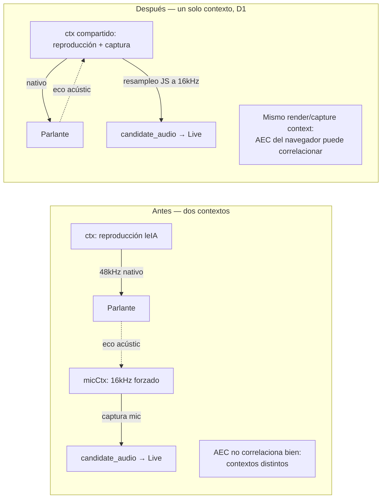

# Análisis del Arquitecto — Eco en modo live: barge-in poco confiable y leIA interrumpiendo al candidato

## 0. Metadatos

- **ID Ticket:** FIX-LIVE-ECHO-BARGEIN
- **Versión:** v1.0
- **Fecha:** 2026-07-07
- **Contrato analizado:** no hay contrato del Elicitador — el input es el hallazgo §8 de `ENTREVISTADOR_IA_LEIA_TUNE-LIVE-AUDIO_EJECUCION_v1.0.md` (v1.1), con evidencia de una entrevista real completa (`53774dc2-70ac-46ab-90f2-3b93f8e8f893`, 104s): el log de barge-in solo se disparó una vez pese a varios intentos aparentes del candidato, y la transcripción muestra al candidato diciendo *"Sí, pero seguí hablando y no me escuchás"*.
- **Base de código verificada:** branch `feature/arnes-etapa-1-candidato`, commit `e03411b` + el scheduler gapless de TUNE-LIVE-AUDIO aplicado en el working tree (sin commitear: `frontend/app/sala/[id]/page.tsx` y `backend/src/services/interview/engine.ts` modificados). Se analiza sobre ese estado real, no solo sobre el commit.
- **Mapa del Sistema:** `docs/specs/ARQUITECTURA_DEL_SISTEMA.md`, fresco.

---

## 1. Resumen Ejecutivo

- La hipótesis que trajo el Ejecutor (routear el audio de leIA por un elemento `<audio>` para que el AEC del navegador lo referencie) **no se descarta pero se reemplaza por una causa más concreta y verificable en el código real**: la captura del micrófono del candidato usa un **`AudioContext` separado, forzado a 16kHz** (`micCtx` en `startCandidateAudioCapture`), mientras que la reproducción de leIA usa **otro `AudioContext` distinto**, a la tasa nativa del dispositivo (típicamente 48kHz). Tener dos contextos de audio con tasas distintas para captura y reproducción es un anti-patrón conocido en apps Web Audio + WebRTC: rompe la referencia de eco que usa el `echoCancellation` del navegador para cancelar lo que el propio dispositivo está reproduciendo — la cancelación de eco necesita correlacionar la señal de renderizado con la de captura, y dos contextos con tasas distintas dificultan o impiden esa correlación.
- **Consecuencia coherente con los dos síntomas reportados:** si el micrófono capta parte de la voz de leIA como si fuera del candidato, Gemini Live recibe una señal de entrada contaminada — de ahí el barge-in inconsistente (el VAD de Live no distingue "eco" de "candidato interrumpiendo") y que el modelo no ceda el turno (desde su perspectiva, "el candidato" sigue emitiendo audio mientras él también habla).
- **Se descarta explícitamente** la mitigación de silenciar/cortar el envío de `candidate_audio` mientras leIA habla (un guard tipo `isBotSpeaking()`, análogo al del modo `meet`): el barge-in real de Gemini Live **depende de recibir audio continuo** mientras el modelo habla — es así como su VAD server-side detecta que el candidato empezó a hablar. Cortar el envío eliminaría la posibilidad de interrumpir, no la mejoraría.
- **Decisión de diseño (D1):** unificar la captura del candidato al **mismo `AudioContext`** que ya usa la reproducción de leIA (eliminar `micCtx` dedicado), resampleando de la tasa nativa del contexto a 16kHz en JavaScript (interpolación lineal simple) dentro del mismo `onaudioprocess`. Esto es un cambio acotado al frontend, no requiere tocar el backend ni el contrato de Live.
- Si tras esta corrección el re-test del humano sigue mostrando eco, la escalada siguiente sería enrutar la reproducción por un elemento `<audio>` real (hipótesis original del Ejecutor) — documentado como plan B, no parte de este ticket.
- Estimación total: **~2.75h** → Plan Ejecutor único (gate de granularidad no disparado).

---

## 2. Disposición de Gaps Heredados

Sin contrato del Elicitador; el hallazgo llega con una hipótesis del Ejecutor que se resolvió con evidencia de código:

| # | Punto | Disposición |
|---|---|---|
| 1 | Hipótesis del Ejecutor: el AEC no cubre audio ruteado por Web Audio API (`ctx.destination`) vs. un elemento `<audio>` HTML | RESUELTO (reformulada) → la exploración encontró una causa más concreta y accionable: dos `AudioContext` con tasas distintas para captura y reproducción, no el tipo de nodo de salida. Ver §3. |
| 2 | ¿Gatear el envío de `candidate_audio` mientras leIA habla, análogo a `isBotSpeaking()`? | RESUELTO → descartado. Rompería el barge-in por diseño (Live necesita audio continuo para detectar la interrupción). Documentado para que no se vuelva a proponer en el futuro sin este contexto. |

---

## 3. Diseño Técnico

### Evidencia de código (verificada, no inferida)

- `frontend/app/sala/[id]/page.tsx`, `joinCall()`: crea `ctx = new AudioContext()` (tasa nativa del dispositivo) y lo guarda en `audioCtxRef.current` — este es el contexto de **reproducción** de leIA (scheduler gapless de TUNE-LIVE-AUDIO, `masterGain → ctx.destination`).
- `startCandidateAudioCapture(stream)`: crea **otro** `AudioContext` con `{ sampleRate: 16000 }` forzado (`micCtx`), independiente del anterior, y arma ahí la cadena `source → processor → silentGain → micCtx.destination` para capturar el mic y mandarlo a Gemini Live vía `candidate_audio`.
- Dos `AudioContext` con tasas distintas para captura y reproducción de la misma app impiden que la cancelación de eco del navegador (`echoCancellation: true`, seteado en las constraints de `getUserMedia`) correlacione correctamente la señal que el dispositivo está reproduciendo con la que el mic está captando — el navegador necesita esa correlación para restar el eco antes de que la señal salga del `MediaStreamTrack`.

### Componentes a modificar

| Archivo | Cambio |
|---|---|
| `frontend/app/sala/[id]/page.tsx` | `startCandidateAudioCapture` deja de crear `micCtx` propio; reutiliza `audioCtxRef.current` (el mismo contexto de reproducción). Resamplea de `ctx.sampleRate` a 16000 en JS antes de mandar el PCM. `stopCandidateAudioCapture` ya no cierra un contexto propio (no le pertenece). Eliminar `micCtxRef` (ya no aplica); el nodo `MediaStreamAudioSourceNode` pasa a necesitar su propia ref para poder desconectarlo en el cleanup. |

### Decisiones de diseño

- **D1 — Un solo `AudioContext` compartido para captura y reproducción** (origen: análisis propio, evidencia de código). Es el fix de menor riesgo: no cambia el contrato de audio hacia Gemini Live (sigue siendo PCM 16kHz mono), no toca el backend, y elimina la variable más concreta que rompe la correlación de eco. El resampleo (`ctx.sampleRate` → 16000) se hace con interpolación lineal simple en el mismo callback `onaudioprocess` que ya arma el PCM — calidad suficiente para VAD de voz, no para alta fidelidad (aceptable para este proyecto).
- **D2 — Rechazado: gate de silencio sobre `candidate_audio` mientras leIA habla.** Rompería el barge-in por diseño. Ver §1.
- **D3 — Diferido: reproducción vía elemento `<audio>` HTML.** Si D1 no resuelve el síntoma en el re-test del humano, esta es la escalada siguiente (cambio más grande: requiere un `MediaStreamAudioDestinationNode` conectado a un `<audio>` oculto, maneja autoplay policies distinto). No se implementa en este ticket — se deja como nota para no repetir el diagnóstico si D1 resulta insuficiente.
- **D4 — Nota operativa (no es tarea de código):** la calidad de cancelación de eco acústico real también depende del hardware (auriculares vs. parlantes+mic abiertos). Se documenta como recomendación para el re-test, no como parte de la Verificación Final automatizable.

### Flujo (referencia para el Ejecutor)

---

## 4. Riesgos

| ID | Riesgo | Severidad | Mitigación |
|---|---|---|---|
| R1 | El resampleo por interpolación lineal introduce algo de aliasing/pérdida de calidad frente al `micCtx` a 16kHz nativo | Baja | Aceptable para voz/VAD (no para audio de alta fidelidad); si la transcripción de entrada empeora perceptiblemente, es un hallazgo nuevo a reportar, no a resolver en este ticket (la calidad de transcripción de entrada ya es un riesgo conocido no bloqueante desde el spike de la Etapa 1). |
| R2 | El fix D1 corrige la causa más probable pero no está 100% garantizado (no hay forma de instrumentar acústicamente el AEC del navegador desde este entorno) | Media | El re-test del humano con el log de `interrupted` (ya instrumentado en TUNE-LIVE-AUDIO) es el criterio de éxito real. Si no mejora, D3 queda documentada como siguiente paso. |
| R3 | Compartir el contexto de reproducción para la captura podría, en teoría, introducir contención de scheduling en dispositivos muy limitados | Baja | El proyecto ya asume hardware de escritorio/laptop moderno (sin constraint de recursos documentado en el Mapa); no se mitiga activamente. |

---

## 5. Estimación

| Tarea | Estimación |
|---|---|
| T01 — Unificar `AudioContext` de captura y reproducción + resampleo en JS | 1.5h |
| T02 — Limpieza de refs obsoletas (`micCtxRef` → ref del source node) | 15 min |
| T03 — Verificación (builds + regresión pipeline + smoke live + guion de re-test con el log de barge-in) | 1h |
| **Total** | **~2.75h** → Plan Ejecutor único |

---

## 6. Actualizaciones sugeridas al Mapa del Sistema

Ninguna estructural.

---

## 7. Puntero al Plan Ejecutor

`docs/specs/ENTREVISTADOR_IA_LEIA_FIX-LIVE-ECHO-BARGEIN_PLAN_EJECUTOR_v1.0.md`

---

## CHANGELOG

- v1.0 (2026-07-07): Análisis inicial. Causa raíz reformulada de "tipo de nodo de salida" a "contextos de audio separados con tasas distintas" tras inspección de código. D1 (unificar contexto) como fix principal; D2 (gate de silencio) rechazado explícitamente; D3 (elemento `<audio>`) diferida como plan B.
