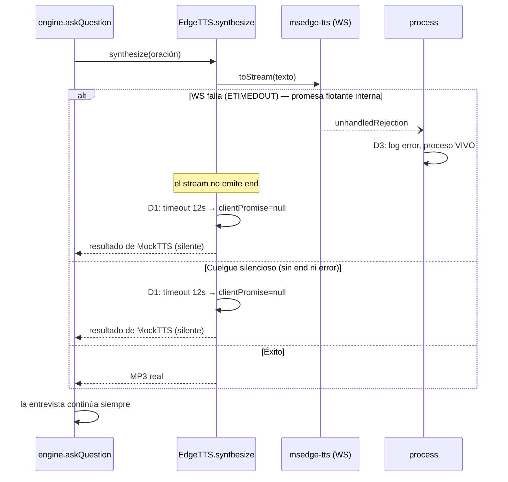

# Análisis del Arquitecto — Robustez de la capa TTS (crash y cuelgue de msedge-tts)

## 0. Metadatos

- **ID Ticket:** FIX-TTS-ROBUSTEZ
- **Versión:** v1.0
- **Fecha:** 2026-07-10
- **Contrato analizado:** hallazgo con evidencia `[TEST-EXEC]` documentado como "Hallazgo Fuera de Alcance" en los Informes de Ejecución de ETAPA1-CIERRE (§ hallazgos) y FIX-CV-PROMPT (§5). Reproducido 3 veces en sesiones reales de trabajo.
- **Base de código verificada:** branch `feature/arnes-etapa-1-candidato`, commit `5b26319` = HEAD. CUMPLIDA.
- **Mapa del Sistema:** consultado como orientación; el diseño se validó contra el código real (regla: el código manda).

---

## 1. Resumen Ejecutivo

- **Evidencia (3 reproducciones reales):** (a) crash del proceso Node completo por `Error: Edge TTS WebSocket error: (code=ETIMEDOUT)`; (b) variante nueva: **cuelgue silencioso** — proceso vivo y respondiendo HTTP, pero la promesa de síntesis nunca resuelve ni rechaza y la entrevista queda congelada; (c) `GeminiTTS` devolvió `400 INVALID_ARGUMENT` en una síntesis (cae a Edge por su fallback interno, encadenando la fragilidad).
- **Causa raíz (a) confirmada contra el código de la librería:** en `msedge-tts/dist/MsEdgeTTS.js`, `_rawSSMLRequest()` hace `this._send(request).then();` — una **promesa flotante sin handler de rechazo**. Cuando el WS necesita (re)conectar y falla, el `onerror` interno hace `reject(wrapped)` sobre esa promesa huérfana → `unhandledRejection` → Node (≥15, comportamiento default `throw`) mata el proceso. Por eso el try/catch de nuestro `EdgeTTS.synthesize` **nunca lo ve**: la rejection no viaja por nuestra cadena de llamadas.
- **Causa raíz (b) confirmada contra nuestro código:** `EdgeTTS.synthesize` espera `end`/`error` del stream **sin ningún timeout**; si el servidor no responde (o el WS muere sin emitir a ese stream), la promesa queda pendiente para siempre. Además `clientPromise` se cachea de por vida: un cliente zombie (WS muerto) queda cacheado y envenena todas las síntesis siguientes.
- **Causa raíz (c):** `GeminiTTS.synthesize` usa `fetch` sin `AbortSignal` (puede colgar) y su fallback es EdgeTTS (correcto como diseño, pero hoy hereda las fragilidades de arriba). El `400` puntual ya está manejado (throw → catch → fallback); no requiere más que el timeout.
- **Los llamadores del engine ya son defensivos** (`Promise.allSettled` en muletillas, try/catch por oración en `askQuestion`, `.catch(() => {})` en pre-síntesis): no hay que tocar `engine.ts`. El problema vive íntegramente en la capa TTS + la falta de red de seguridad de proceso.
- **Diseño en 3 capas:** D1 timeout duro + descarte de cliente zombie en `EdgeTTS`; D2 `AbortSignal.timeout` en el fetch de `GeminiTTS`; D3 red de seguridad global `process.on('unhandledRejection')` en `server.ts` (log fuerte + proceso vivo) — la única defensa no invasiva posible contra la promesa flotante interna de la librería.
- **Degradación resultante:** ante cualquier falla/timeout de TTS, el driver cae a `MockTTS` (MP3 silente con duración realista) → la entrevista **continúa** (turno sin voz, transcripción y flujo intactos) en lugar de crashear o congelarse.
- Sin dependencias nuevas, sin parchear `node_modules`, sin cambiar la interfaz `TTSService`.
- Estimación total: **~4.5h** → Plan Ejecutor único.

---

## 2. Validación del contrato

| Elemento | Veredicto |
|---|---|
| Evidencia del crash (a) | `[TEST-EXEC]` — stack trace real capturado 2 veces (log de sesión), formato consistente con unhandledRejection re-lanzada como uncaught |
| Evidencia del cuelgue (b) | `[TEST-EXEC]` — observado en la corrida 2 de FIX-CV-PROMPT T04 (proceso vivo, HTTP OK, entrevista congelada en `askQuestion`) |
| Evidencia Gemini 400 (c) | `[TEST-EXEC]` — log real con `INVALID_ARGUMENT` en la corrida 1 de FIX-CV-PROMPT T04 |
| Causa raíz declarada en el pedido ("no catcheable en la cadena synthesize→commitAnswer") | CONFIRMADA y precisada: es una promesa flotante interna (`_send(request).then()` sin catch), no una excepción síncrona |

## 3. Disposición de Gaps Heredados

| Gap | Disposición |
|---|---|
| Hallazgo msedge-tts (ETAPA1-CIERRE + FIX-CV-PROMPT) | RESUELTO por este ticket (es su objeto) |
| Causa raíz del 400 de GeminiTTS no investigada | PROPAGADO → R4: este ticket agrega timeout y conserva el fallback; investigar el 400 (posible tema de modelo/cuota/voz) queda fuera de alcance, mitigado porque la cadena ya no puede colgar ni crashear |
| `defaultInterviewTtsDriver()` resuelve a `gemini` aunque `TTS_DRIVER=mock` (fricción observada en T04 de FIX-CV-PROMPT) | PROPAGADO → nota, sin acción: es una decisión de producto pre-existente (las entrevistas usan voz real por defecto; el constraint de DB solo admite `gemini`/`edge`). No es fragilidad: con este ticket, cualquier falla degrada con gracia |

---

## 4. Diseño Técnico

### Componentes a modificar

| Archivo | Cambio |
|---|---|
| `backend/src/services/tts/index.ts` | Exportar helper puro `withTimeout<T>(promise, ms, label): Promise<T>` y constante `TTS_SYNTH_TIMEOUT_MS = 12_000` |
| `backend/src/services/tts/edge.ts` | `synthesize` envuelto en `withTimeout`; ante error **o timeout**: `this.clientPromise = null` (descarta cliente zombie) + destroy del stream + fallback a mock (ya existente). Timeout inyectable por constructor para tests |
| `backend/src/services/tts/gemini.ts` | `fetch` con `signal: AbortSignal.timeout(TTS_SYNTH_TIMEOUT_MS)` (fallback a Edge ya existente se conserva) |
| `backend/src/server.ts` | `process.on('unhandledRejection', ...)`: log `logger.error` con stack + contador; el proceso sigue vivo. NO se toca `uncaughtException` (default de Node se mantiene) |
| `backend/src/services/tts/tts.test.ts` (nuevo) | Tests de `withTimeout`, de fallback por cuelgue en EdgeTTS (msedge-tts mockeado con stream que nunca emite `end`) y de reset del cliente |
| `backend/scripts/verify-unhandled-rejection.ts` (nuevo) | Script standalone: instala el mismo handler, dispara una rejection flotante idéntica al patrón de la librería, y sale con código 0 solo si el proceso sobrevivió — evidencia ejecutable de D3 |

### Flujo de falla resultante (Mermaid)

### Decisiones de diseño

- **D1 — Timeout duro + descarte de cliente zombie en EdgeTTS** (origen: análisis propio sobre evidencia (b)). 12s cubre la síntesis de la oración más larga observada con margen; muletillas y oraciones normales resuelven en 1-3s. El reset de `clientPromise` es imprescindible: sin él, el primer WS muerto envenena todas las síntesis futuras del proceso.
- **D2 — AbortSignal.timeout en GeminiTTS** (origen: análisis propio sobre evidencia (c) + simetría con D1). `fetch` sin signal puede colgar igual que el WS. Node ≥18 lo trae nativo; el catch existente ya rutea el AbortError al fallback.
- **D3 — Red de seguridad global `unhandledRejection` (log + vivir)** (origen: análisis propio; **es la única decisión con trade-off real, se pide confirmación del desarrollador**). La promesa flotante está *dentro* de la librería y no es alcanzable desde ningún try/catch nuestro; las alternativas eran parchear `node_modules` (frágil, requiere patch-package = dependencia nueva) o forkear la librería (costo alto). Trade-off aceptado: un handler global también silencia (logueándolas) rejections de otros orígenes; mitigación: log en nivel `error` con stack completo, para que nada pase inadvertido. `uncaughtException` NO se toca (mantener el default de crash para excepciones síncronas es lo correcto: el estado podría quedar corrupto).
- **D4 — engine.ts NO se toca:** sus llamadores ya degradan bien; agregar más capas ahí sería redundancia sin valor.
- **D5 — La cadena de fallbacks existente se conserva** (Gemini→Edge→Mock y Edge→Mock): con timeouts en cada eslabón, el peor caso es ~24s de espera (Gemini 12s + Edge 12s) antes del silente — aceptable para un caso extremo doble-falla; no se agrega complejidad para optimizarlo.

---

## 5. Riesgos

| ID | Riesgo | Severidad | Mitigación |
|---|---|---|---|
| R1 | El handler global de unhandledRejection oculte bugs futuros no relacionados con TTS | Media | Log nivel `error` con stack completo y contador; revisar logs en cada sesión de prueba. Aceptado como costo de supervivencia del proceso |
| R2 | 12s de timeout percibidos como silencio largo en demo si Edge falla | Baja | La muletilla ya suena antes; el peor caso doble-falla (~24s) es extremo. Ajustable por constante si molesta |
| R3 | El mock de msedge-tts en tests divergiendo de la librería real | Baja | El script `verify-unhandled-rejection.ts` reproduce el patrón real de promesa flotante; smoke de regresión con Edge real en la verificación final |
| R4 (heredado) | Causa raíz del 400 de GeminiTTS sin investigar | Baja | Timeout + fallback lo vuelven no-bloqueante; investigar aparte si se quiere usar Gemini TTS como driver principal |

---

## 6. Estimación

| Tarea | Estimación |
|---|---|
| T01 — `withTimeout` + timeout/reset en EdgeTTS | 1.5h |
| T02 — AbortSignal.timeout en GeminiTTS | 0.5h |
| T03 — Handler global unhandledRejection + script de verificación | 1h |
| T04 — Tests unitarios (tts.test.ts) | 1h |
| T05 — Verificación final (suite + smoke de regresión con Edge real) | 0.5h |
| **Total** | **~4.5h** → Plan Ejecutor único (gate ≤8h: OK) |

---

## 7. Actualizaciones sugeridas al Mapa del Sistema

Agregar a la sección de la capa TTS: cadena de fallbacks (Gemini→Edge→Mock), timeout global de síntesis (12s) y la red de seguridad de proceso (`unhandledRejection` logueada, no fatal).

## 8. Puntero al Plan Ejecutor

`docs/specs/ENTREVISTADOR_IA_LEIA_FIX-TTS-ROBUSTEZ_PLAN_EJECUTOR_v1.0.md`

---

## CHANGELOG

- v1.0 (2026-07-10): Análisis inicial. Causa raíz de crash confirmada en la fuente de msedge-tts (`_send(request).then()` flotante); cuelgue por ausencia de timeout + cliente zombie cacheado. Decisiones D1-D5.
