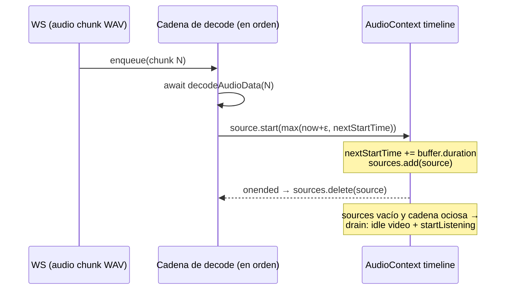

# Análisis del Arquitecto — Afinado de audio del modo live (playback entrecortado + barge-in verificable)

## 0. Metadatos

- **ID Ticket:** TUNE-LIVE-AUDIO
- **Versión:** v1.0
- **Fecha:** 2026-07-07
- **Contrato analizado:** no hay contrato del Elicitador — el input es el hallazgo de la primera entrevista real completa en modo `voiceMode='live'` (interview `7e096b79`, 14 turnos, 233s, sesión Live estable de punta a punta, evaluaciones e informes generados). Síntoma confirmado `[USR]`: la voz de leIA se reproduce entrecortada (tartamudeo). Excepción deliberada al pipeline por ser un ticket de afinado acotado con evidencia real.
- **Base de código verificada:** branch `feature/arnes-etapa-1-candidato`, commit `e03411b` = HEAD actual. CUMPLIDA.
- **Mapa del Sistema:** `docs/specs/ARQUITECTURA_DEL_SISTEMA.md`, fresco.

---

## 1. Resumen Ejecutivo

- **Síntoma confirmado `[USR]`:** la voz de leIA en modo `live` suena entrecortada. La evidencia interna lo corrobora doblemente: la propia leIA dijo en el turno T2 *"Se cortó un poquito, ¿podrías repetir lo último que dijiste?"*.
- **Causa raíz `[CODE]`:** Gemini Live streamea el audio en muchos chunks PCM chicos; cada uno se envuelve en WAV y se encola en `playNext()` (`frontend/app/sala/[id]/page.tsx`), que reproduce **un chunk por vez** y encadena el siguiente con `setTimeout(playNext, 40)` tras `onended`, más la latencia async de `decodeAudioData`. Ese diseño era correcto para el pipeline TTS (audio por oraciones completas, gaps naturales en los límites); con streaming produce huecos audibles entre cada chunk.
- **Hallazgo secundario:** el evento `interrupted` de Live (barge-in) no deja ninguna línea de log — ni en `VoiceSession` ni en el engine — por lo que el test de barge-in de la Etapa 1 quedó **sin poder verificarse** (el usuario no recuerda si leIA se calló al hablarle encima, y el log no puede confirmarlo ni refutarlo).
- **Diseño elegido:** reproductor con **agendado gapless sobre el timeline del AudioContext** (cada buffer decodificado se agenda en `nextStartTime` y se encadena sin huecos), en el frontend. Se descartó la acumulación de PCM en el backend porque agrega latencia (contrario al esfuerzo de `thinkingBudget: 0`) y solo reduce los huecos, no los elimina.
- **Consecuencia de diseño:** con agendado adelantado puede haber **varios sources en vuelo**; `stop_audio` (barge-in) debe frenarlos a TODOS, no solo el actual — el `currentSourceRef` único de hoy es insuficiente en el nuevo modelo.
- Fuera de alcance (ratificado `[USR]`): calidad de transcripción de entrada de Live (riesgo conocido no bloqueante, documentado en el spike).
- Estimación total: **~4h** → Plan Ejecutor único (gate de granularidad no disparado).

---

## 2. Disposición de Gaps Heredados

Sin contrato del Elicitador; los puntos abiertos del hallazgo quedaron todos con disposición:

| # | Punto | Disposición |
|---|---|---|
| 1 | ¿El playback entrecortado es de salida (leIA) o de entrada (candidato)? | RESUELTO → `[USR]` confirmó salida (punto 1). La entrada queda fuera de alcance. |
| 2 | ¿El barge-in funcionó en la entrevista real? | PROPAGADO → no verificable hoy (sin log). Se convierte en T02 (log de `interrupted`) + procedimiento de re-test en la Verificación Final. |

---

## 3. Diseño Técnico

### Componentes a modificar

| Archivo | Cambio |
|---|---|
| `frontend/app/sala/[id]/page.tsx` | Reemplazar el mecanismo de `playNext()` (un chunk por vez + `setTimeout(40)`) por un **scheduler gapless**: cadena de decodificación en orden (promise chain) + `source.start(nextStartTime)` con `nextStartTime = max(ctx.currentTime + ε, nextStartTime) + buffer.duration`; set de sources activos para `stop_audio`; estados `leiaSpeaking`/videos/`startListening` disparados por "primer source agendado" y "último source terminado con cola vacía". |
| `backend/src/services/interview/engine.ts` | `logger.info({ interviewId }, 'voice-session: barge-in — audio interrumpido por el candidato')` en el callback `onInterrupted` (hoy solo reenvía `stop_audio` sin rastro). |

### Decisiones de diseño

- **D1 — Gapless en el frontend, no buffering en el backend** (origen: análisis propio). El agendado sobre el timeline del AudioContext elimina los huecos por completo y no agrega latencia. La acumulación de PCM en el backend fue descartada: agrega delay de buffering (contrario al objetivo de latencia de la Etapa 1) y solo espacia los huecos en vez de eliminarlos.
- **D2 — Un solo scheduler para ambos modos (live y pipeline)** (origen: análisis propio). No se bifurca el reproductor por `voiceMode`: para el pipeline, las oraciones llegan más lento de lo que se reproducen, así que `nextStartTime` queda en el pasado y el agendado degrada a "arrancar ya" — comportamiento equivalente al actual menos el gap artificial de 40ms. Dos code paths duplicados driftearían; el riesgo de regresión del pipeline se cubre con el smoke de regresión de la Verificación Final.
- **D3 — `stop_audio` frena todos los sources agendados** (origen: consecuencia de D1). Se mantiene un `Set` de sources en vuelo; `stop_audio` los detiene a todos y resetea `nextStartTime`. El `currentSourceRef` único actual queda reemplazado.
- **D4 — El barge-in se vuelve verificable por log** (origen: hallazgo). Con la línea de log de T02, el procedimiento de re-test es objetivo: hablar por encima de leIA → el log del backend debe mostrar la línea de barge-in Y el audio debe cortarse en el frontend. Sin esa línea, el test vuelve a depender de la memoria del tester.

### Flujo del scheduler (referencia para el Ejecutor)

---

## 4. Riesgos

| ID | Riesgo | Severidad | Mitigación |
|---|---|---|---|
| R1 | Regresión del playback en modo pipeline (el scheduler nuevo aplica a ambos modos, D2) | Media | Smoke de regresión obligatorio en la Verificación Final: entrevista pipeline completa con audio audible y estados (talk/idle, CC, listening) correctos. |
| R2 | `decodeAudioData` fuera de orden rompería la secuencia | Baja | La cadena de promesas decodifica y agenda estrictamente en orden de llegada (un chunk no se agenda hasta que el anterior fue agendado). |
| R3 | El barge-in real puede seguir sin funcionar (nunca se verificó) | Media | T02 lo hace observable; el re-test manual queda definido con criterio objetivo (línea de log + corte audible). Si el re-test falla, es un hallazgo nuevo para el Arquitecto, no parte de este ticket. |

---

## 5. Estimación

| Tarea | Estimación |
|---|---|
| T01 — Scheduler gapless + stop_audio multi-source | 2.5h |
| T02 — Log de `interrupted` en el engine | 15 min |
| T03 — Verificación (regresión pipeline + smoke live + guion de re-test barge-in) | 1h |
| **Total** | **~4h** → Plan Ejecutor único |

---

## 6. Actualizaciones sugeridas al Mapa del Sistema

Ninguna estructural (el reproductor de la sala ya figura como componente del frontend).

---

## 7. Puntero al Plan Ejecutor

`docs/specs/ENTREVISTADOR_IA_LEIA_TUNE-LIVE-AUDIO_PLAN_EJECUTOR_v1.0.md`

---

## CHANGELOG

- v1.0 (2026-07-07): Análisis inicial del afinado de audio del modo live, con evidencia de la primera entrevista real (14 turnos, 233s). Decisiones D1-D4.
